# Sandy（DN0020）ビルドガイド

このドキュメントは、Sandy（DN0020）を組み立てるためのビルドガイドです。  
Sandyのコンセプトや特徴、ビルド例などについては、こちらの[README](/README.md)をご覧ください。

ビルドガイド全体に目を通して作業手順を把握しておくとミスの防止につながりますので、ぜひ、一度お読みになってから組み立て作業を始めてください。

作業手順をしっかりと確認しながら組み立てたい方は、

<details>
<summary>《《《 詳しい説明 》》》</summary>

ここに追加の説明を表示します。
</details>

と書かれたところをクリックすると、追加の説明が表示されます。

---

## 目次

<!-- @import "[TOC]" {cmd="toc" depthFrom=2 depthTo=2 orderedList=false} -->

<!-- code_chunk_output -->

- [目次](#目次)
- [注意事項](#注意事項)
- [部品リスト](#部品リスト)
- [組み立てに使用する工具](#組み立てに使用する工具)
- [組み立て手順](#組み立て手順)
- [参考資料](#参考資料)
- [サービスマニュアル](#サービスマニュアル)

<!-- /code_chunk_output -->

---

## 注意事項

- 試作版

  Sandy（DN0020）は試作版です。  

- 組み立て難易度：高

  SHコネクタのはんだ付けがそこそこ難しいです。  
  テスターで確認しながら作業を進めると、失敗を防ぎ、手戻りなく進められるでしょう。  
  個人的な所感としては、はんだ付けを数回やった程度の方にはかなりチャレンジングな作業になると思います。  
  これを機にテスターを購入してはんだ付けの腕前を上げる気持ちで挑むか、コネクタ取り付けサービスの利用をご検討ください。

- スイッチの取り付け

  一部のスイッチを上下反対向きに取り付けます。

- ビルドガイド

  一部の写真はDN0030のものを掲載しています。  
  パーツ位置や表記が異なるだけで、基本的には同じです。

- ファームウェアについて

  出荷時に書き込み済みのファームウェアは、QMKバージョン 0.18.17です。  
  [Remap for QMK Firmware 0.18.17 or lower](https://qmk018.remap-keys.app)で、キーの割り当てを変更することができます。  
  ロータリーエンコーダへのキー割り当てをおこなうには、Remapで定義ファイル`sandy_v01_via.json`をインポートしてください。

  QMKバージョン 0.22.14のファームウェアに書き換えると、[Remap](https://remap-keys.app/)で、ロータリーエンコーダを含むキーの割り当てを変更できるようになります。

## 部品リスト

このキットを組み立てるためには、[キット内容](#キット内容)に加え、[別途用意が必要な部品](#別途用意が必要な部品)が必要です。  
好みに合わせて必要な数をお買い求めください。

[オプション部品](#オプション部品)は、使いたい機能に応じて用意してください。  

### キット内容

| 部品名 | 個数 | 備考 |
| :-- | --: | :-- |
| ご案内リーフレット | 1 | |
| 基板Base | 1 | Baseのみ部品実装済み |
| 基板Mid | 1 | |
| 基板Top | 1 | Mid用スイッチプレートを兼ねる |
| Base用スイッチプレート | 1 | 捨て基板（捨て板）付き |
| Top用スイッチプレート | 1 ||
| ボトムプレート | 1 ||
| ダイオード<br>表面実装（SMD）タイプ, 1N4148W<br>[高速スイッチング・ダイオード　１Ｎ４１４８Ｗ](https://akizukidenshi.com/catalog/g/gI-07084/) | 34 | 予備2個含む |
| SHコネクタ<br>JST SH ベース サイド型 4pin 面実装<br>[HR(Joint Tech Elec) A1001WR-S-04P](https://www.lcsc.com/product-detail/_HR-Joint-Tech-Elec-_C371510.html) | 12 | 取り付けサービス利用時は、各基板に取り付け済み |
| JST SH 4pinケーブル<br>（いわゆるQwiicケーブル）<br>[PRT-17260](https://www.digikey.jp/ja/products/detail/sparkfun-electronics/PRT-17260/13629028) | 6 | ケーブルの取り回しを考え、長さ5-10cm程度を推奨。<br>国内での販売例：<br>- [Qwiicケーブル（Qwiic -Qwiic）50 mm](https://www.switch-science.com/products/6896?_pos=1&_sid=bc641ada5&_ss=r)<br>- [SparkFun　PRT-17260 Qwiicケーブル (50mm)](https://www.sengoku.co.jp/mod/sgk_cart/detail.php?code=EEHD-5ZMM) |
| スペーサー<br>両メネジ M2 3mm<br>[ヒロスギ ARB-2003E](https://hirosugi.co.jp/products/B/ARB-E.html#bx3) | 16 | 丸型、六角いずれも使用可能 |
| 六角ナット<br>M2 2種 高さ1.6mm<br>[ウィルコ FNT-02N-2](https://wilco.jp/products/F/FNT-N-2.html) | 22 | |
| ワッシャー<br>内径2.3mm 外径4.3mm 厚さ0.4mm<br>[ウィルコ FW-0204-04N](https://wilco.jp/products/F/FW-N.html#page3) | 19 | |
| ネジ<br>M2 3mm<br>[ウィルコ F-0230N-03](https://wilco.jp/products/F/F-N-02.html#page3) | 32 | |
| ネジ<br>M2 7mm<br>[ウィルコ F-0270N-03](https://wilco.jp/products/F/F-N-02.html#page3) | 11 | |
| LED<br>SK6812MINI<br>[マイコン内蔵ＲＧＢＬＥＤ　ＳＫ６８１２ＭＩＮＩ](https://akizukidenshi.com/catalog/g/gI-15477/) | 4 | |
| スイッチ用ソケット（MX）<br>[MXスイッチ用 Kailh PCBソケット](https://talpkeyboard.net/items/5e02c5405b120c792616bcf9) | 72 | 予備1個含む |

※出荷時期によって、機能的に同等なものへ変更することがあります。

  
基板3枚（※写真はDN0030）  
上から順に、基板Top、基板Mid、基板Base。

  
プレート類（※写真はDN0030）  
上から順に、Top用スイッチプレート、Base用スイッチプレート、ボトムプレート。

### 別途用意が必要な部品

| 部品名 | 個数 | 備考 |
| :-- | :-- | :-- |
| Cherry MX（互換）スイッチ | 69 〜 71 | 組み立てるレイアウトにより使用数が変動します。 |
| キーキャップ<br>Cherry MX（互換）スイッチ用 | 必要数 | 一般的な英語104キーキャップセットに、スペースキー用として1.5uのキー2個を追加すると全て埋めることができます。<br>1.5uのALTキーなどが含まれるセットを使用したり、文字の入っていないブランクのDSAキーキャップなどを追加すると良いでしょう。<br>参考： [Sandy（DN0020）のレイアウト](http://www.keyboard-layout-editor.com/#/gists/19f42cd466b4f3b269f38e3bdd6bf532) |
| USBケーブル （Type-C） | 1 | |

### オプション部品

| 部品名 | 個数 | 備考 |
| :-- | :-- | :-- |
| ロータリーエンコーダ<br>ALPS EC11, EC12または同等品 | 最大 2 | プッシュスイッチ付きにも対応 |
| ロータリーエンコーダ用ノブ（つまみ） | 必要数 | |
| GH60互換ケース | 1 | ケースへの基板の固定には中央と中央下のネジを使用せず、左右2本ずつ合計4本のネジだけで取り付けます。<br>ケース内部の構造によっては取り付けに加工が必要になったり、取り付けできないことがるかもしれません。<br>以下のケースへ取り付けできることを確認済みです。<br>- KBDfans TOFU 60% ALUMINUM CASE<br>- KBDfans 5° FIVE DEGREE 60% ALUMINUM CASE<br>- KBDfans 60% ALUMINUM LOW PROFILE CASE<br>- 60% プラスチックケース（簡単な加工が必要） |

## 組み立てに使用する工具

- 必要な工具

  - 先の細いプラスドライバー（+0）

    M2ネジに対応するもの。

  - はんだ付け関連用品

  - ピンセット

  - マジックペン

    基板の色に近いもの。  
    [プロッキー<細字丸芯+太字角芯>](https://www.mpuni.co.jp/products/felt_tip_pens/water_based/sign_pen/prockey/pm_150tr.html)の角芯側が塗りやすい。

- あると便利な工具

  - テスター

    はんだ付けの難易度が高くミスが起こりがちなので、確認作業や、何か不具合があった場合の原因調査で活躍します。  
    **SHコネクタを取り付ける場合は、ほぼ必須。**

  - フラックスやハンダ吸い取り線

    はんだ付けの修正や、部品の取り外しなどがしやすくなります。

  - M2ナット対応のレンチ

    ナットを締めるのが格段に楽になります。  
    [タミヤ SP.38 工具セット](https://www.tamiya.com/japan/products/50038/index.html)の十字レンチがM2ナットに対応しています。

  - ニッパーやカッターなど

    使用するケースによっては、スイッチの足やケース内のリブをカットする必要があるかもしれません。

  - やすり

    Base用スイッチプレートの捨て基板を切り離したあと、側面を滑らかにします。

## 組み立て手順

手順に沿って、順番に組み立てます。

- `（こだわり作業）`の手順は、完成時の質感を重視した内容であり、不要であれば作業をとばしてもかまいせん。

- `（該当者のみ）`の手順は、条件に該当する場合のみ作業します。

基板の`おもて側`と`うら側`を間違えないよう、注意して作業します。  
うら側には`Back Side`の表記があります。


### 組み立て前の確認

発送前に基板Baseの動作確認をおこなっていますが、輸送時の破損なども考えられるため、念のため確認を行います。

確認結果に問題がある場合は、リーフレットに記載の連絡先へ相談してください。

1. 基板Baseを、USBケーブルでPCやMacに接続する

1. PCやMacで認識されていることを確認する

    - Windows  
      設定 → キーボードに”Sandy”が表示されていること

    - Mac  
      システムレポート → USBに”Sandy”が表示されていること

1. [Remap](https://remap-keys.app/)を開く

    💡ヒント：出荷時のファームウェアを書き換えていない場合は、[Remap for QMK Firmware 0.18.17 or lower](https://qmk018.remap-keys.app)を開きます。

1. "START REMAP FOR YOUR KEYBOARD"をクリックし、キーボード”Sandy”を接続する

1. "Layout Option"で以下のようにレイアウトを指定する

    - Left Shift: 1u + 1u
    - Bottom Keys: 5 keys
    - Rotary Encoder, Left: Off
    - Rotary Encoder, Right: Off
    - 5-way navigation: Off

1. Remapの”Test Matrix Mode”を開く

1. キースイッチの反応を確認する

    基板Baseうら側のスイッチソケット取り付け用パッド（銀色の四角い端子部分）をピンセットなどでショートさせ、画面上のキーの色が青に変わることを確認します。  

    以下のように色が変われば正常です。  
    

### 組み立てるレイアウトを決める

以下のポイントを念頭に、組み立てるレイアウトを決めます。

- キーのサイズ  

  - 左Control：1.25u / 1.5u

  - Enter：1.25u / 1.5u

- ロータリーエンコーダの有無と場所

  最大2個まで取り付けできます。

  - 左側（RE_L1）と中央（RE_L2）のうち、いずれかひとつ

  - 右側（RE_R1）

参考：[Sandy（DN0020）のレイアウト](http://www.keyboard-layout-editor.com/#/gists/19f42cd466b4f3b269f38e3bdd6bf532)

### 基板Topの準備

1. （こだわり作業）基板側面をマジックで塗る

1. SHコネクタを取り付ける（3個）

    うら側（`J1`, `J2`, `J3`）

    基板に描かれた枠に合わせてはんだ付けします。  
    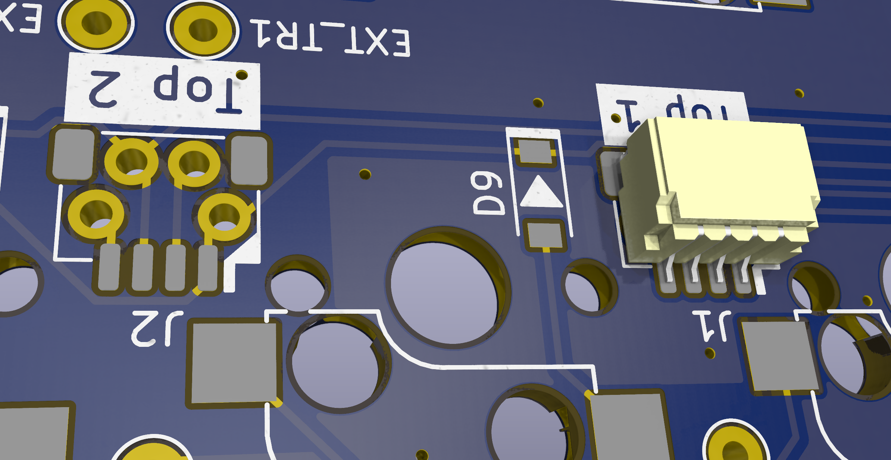

    大きなパッドの片方だけに予備はんだしておき、コネクタの位置を合わせて仮固定します。  
    コネクタが正しい位置に仮固定されたら、残りのパッドと4本のピンをはんだ付けします。  

    隣同士の端子がはんだで繋がっていないか確認し、可能ならコネクタうら側のスルーホールが隣同士で同通しないことをテスターで確認しておきます。

1. ダイオードを取り付ける（19個）

    うら側（`D1` ... `D19`）

    基板とダイオードに描かれた印の向きを合わせて、はんだ付けします。  
    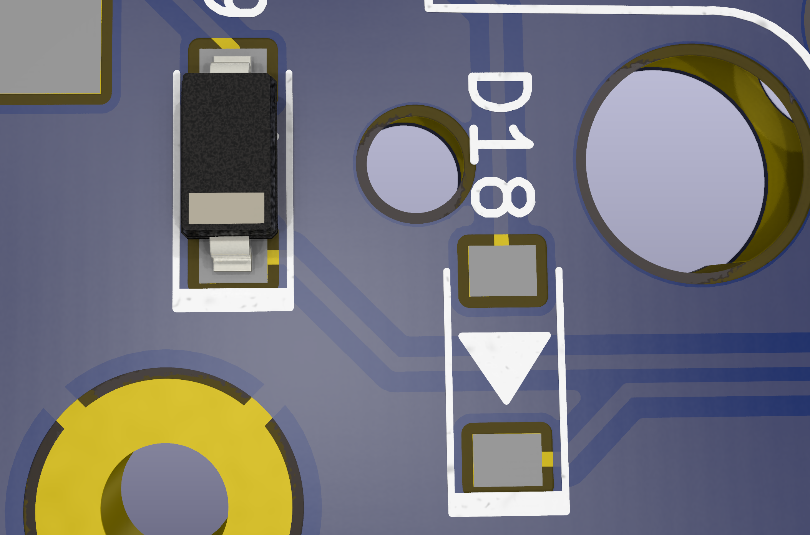

1. スイッチ用ソケットを取り付ける（19個）

    うら側。

    基板に描かれた枠に合わせてソケットを取り付け、はんだ付けします。  
    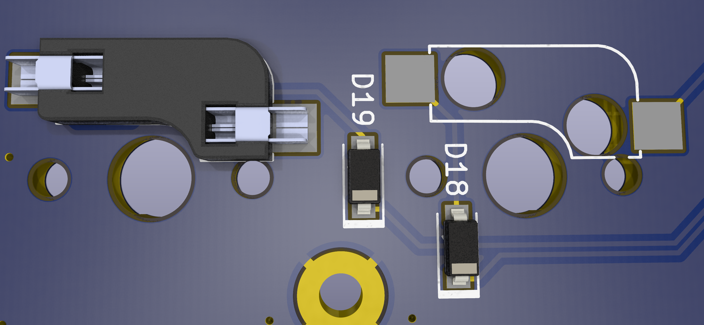

1. SHコネクタへ、ケーブルを差し込む（3本）

    コネクタがもげないよう、コネクタを上から押さえたり後ろを支えたりしながらケーブルを差し込むと安心です。

### 基板Midの準備

1. （こだわり作業）基板側面をマジックで塗る

1. SHコネクタを取り付ける（3個）

    うら側（`J1`, `J2`, `J3`）

1. ダイオードを取り付ける（13個）

    うら側（`D1` ... `D13`）

1. スイッチソケットを取り付ける（13個）

    うら側。

1. 基板Midのおもて側から、ワッシャーを挟んだナットを7mmネジでとめる（11箇所）

    ナットを締め込みすぎないよう注意します。  
    グイグイ・グググッと締め込むのではなく、ナットを回して最初にクッと止まったところでやめます。

    💡ヒント：ネジ穴に印がついている側から、ネジを差し込みます。  
    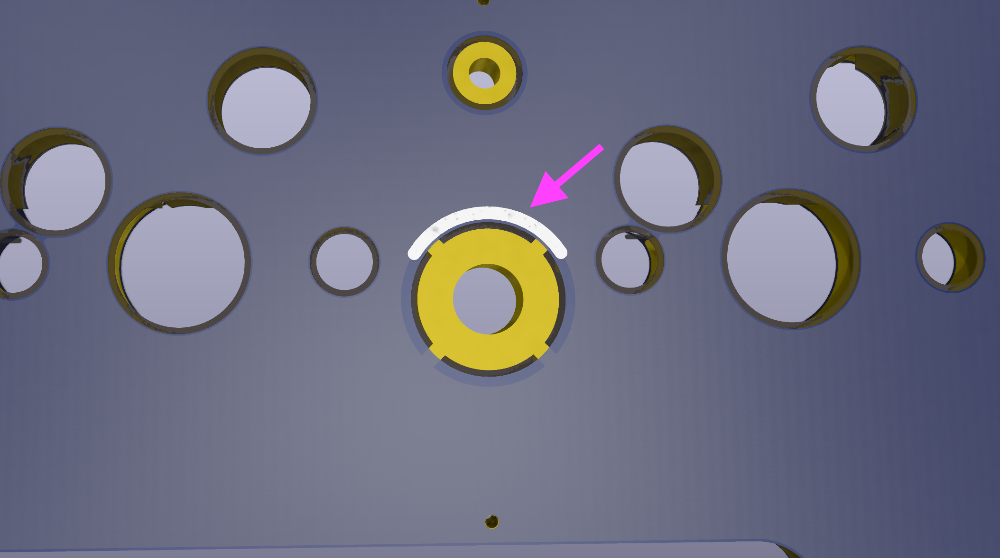  

    ```text
    7mmネジ  
    ↓  
    －－ 基板Mid －－  
    ↓  
    ワッシャー  
    ↓  
    ナット
    ```

    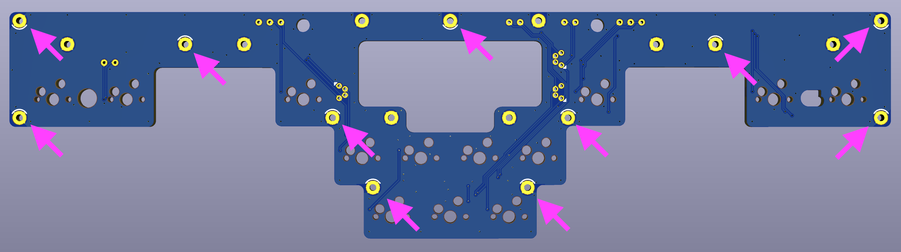

1. 基板Midのうら側から、ワッシャーを挟んだスペーサーを3mmネジでとめる（8箇所）

      ```text
      スペーサー  
      ↑
      ワッシャー  
      ↑
      －－ 基板Mid －－  
      ↑
      3mmネジ  
      ```

    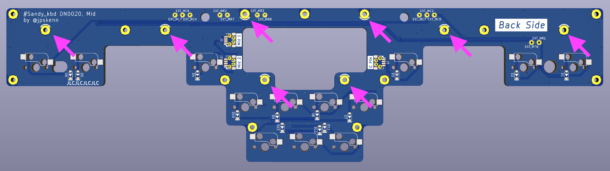

1. 基板Midのコネクタへ、ケーブルを差し込む（3本）

### 基板Baseの準備

1. （こだわり作業）基板側面をマジックで塗る

1. スイッチソケットを取り付ける（39個）

    うら側。  
    組み立てるレイアウトにより、一部の取り付け位置が変わります。  
    ロータリーエンコーダを取り付ける箇所には、ソケットは取り付けません。

1. （該当者のみ）インジケータLEDを取り付ける

    条件：インジケータLEDを使用する場合

    おもて側（`LED1`, `LED2`, `LED3`, `LED4`）

    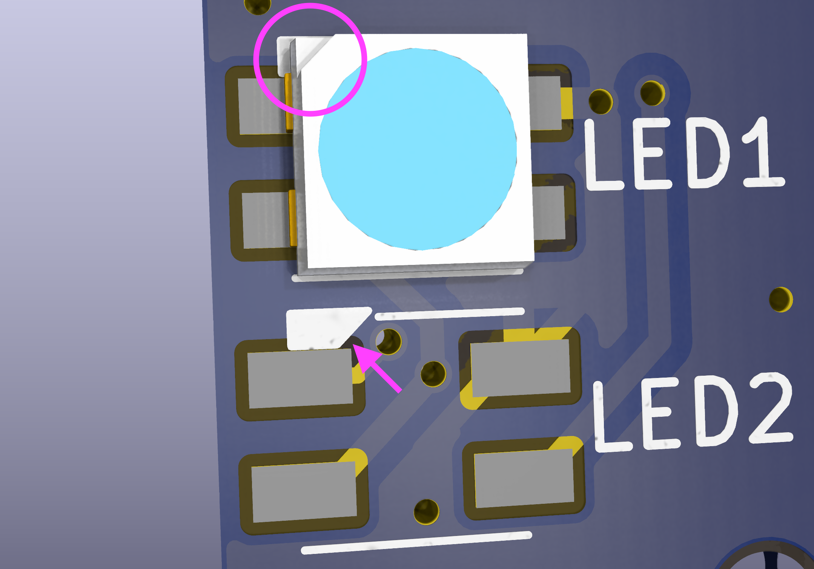  

    270度以下の小手先温度ではんだ付けします。

    基板に描かれた印に、LEDの切り欠き部分を合わせます。  
    4箇所のうち1箇所のパッドだけに予備はんだして、LEDの位置を合わせて仮固定してから、残りのパッドをはんだ付けします。

1. SHコネクタを取り付ける（6個）

    おもて側（`J1`, `J2`, `J3`, `J4`, `J5`, `J6`）

1. （該当者のみ）ロータリーエンコーダを取り付ける

    条件：ロータリーエンコーダを使用する場合

    最大2個まで取り付けできます。

      - 左側（RE_L1）と中央（RE_L2）のうち、いずれかひとつ

      - 右側（RE_R1）

    おもて側からはめ込んで、うら側からはんだ付けします。  

### Top用スイッチプレートの準備

1. （こだわり作業）基板側面をマジックで塗る

### Base用スイッチプレートの準備

1. 捨て基板（プレート外側の枠）をミシン目に沿って切り離す

    プレート本体を破損しないように注意しながら、左右と上下の捨て基板を切り離します。  

    固くて折り取るのが難しい場合は、ミシン目をカッターで10-20回ほどなぞると切り離しやすくなります。

    切り離した箇所が尖っている場合は、やすりなどで滑らかにします。

1. （こだわり作業）基板側面をマジックで塗る

### 各基板をひとつに組み合わせる

1. 基板Midのケーブルを、基板Baseのコネクタへ差し込む

    コネクタ`Mid1`, `Mid2`, `Mid3`同士を接続します。

1. ケーブルを基板間の隙間やBase基板のうら側へ逃しながら、基板Midを基板Baseへ乗せ、ネジ穴へはめ込む

    ケーブルに無理な力がかからないように注意します。

1. 基板Baseと基板Midを仮固定する（全11箇所のうち3箇所程度）

    基板Baseのうら側から、基板Midのネジをナットで止めます。  
    後工程の確認作業が完了するまでは、仮固定の状態で作業を進めます。

    ```text
    －－ 基板Mid －－  
    ↓  
    －－ 基板Base －－  
    ↑  
    ナット
    ```

1. 基板Topのケーブルを、基板Midの穴を通しつつ、基板Baseのコネクタへ差し込む

    コネクタ`Top1`, `Top2`, `Top3`同士を接続します。

1. ケーブルを基板間の隙間やBase基板のうら側へ逃しながら、基板Topを基板Midへ乗せ、ネジ穴へはめ込む

    ケーブルをBase基板の穴からうら側へ逃した例  
    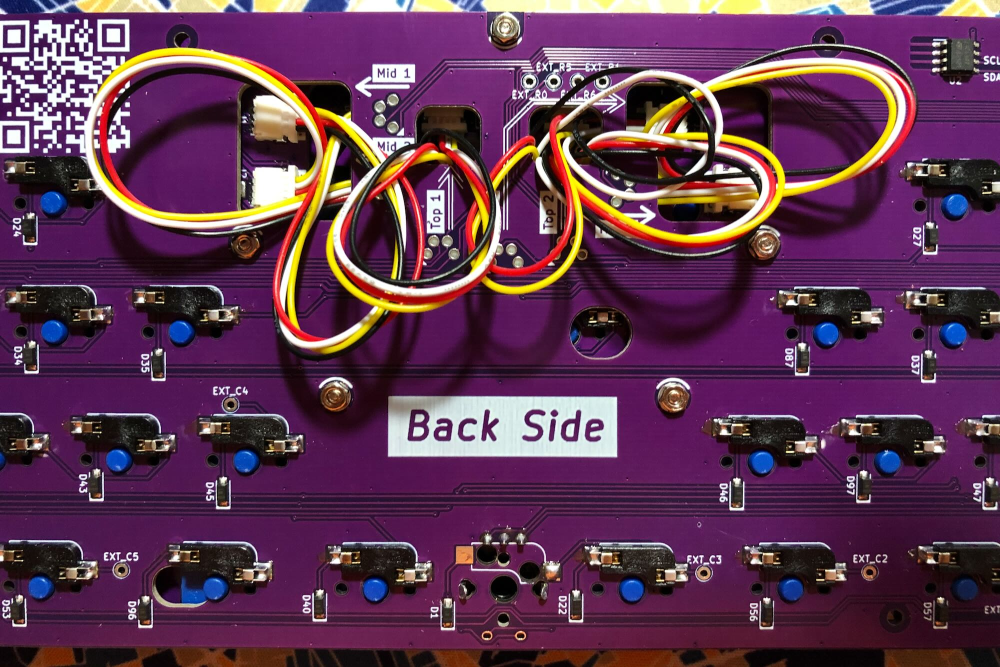

1. 基板Topのおもて側から、基板Midを3mmネジで止める（8箇所）

    ```text
    3mmネジ  
    ↓  
    －－ 基板Top －－  
    ↑  
    －－ 基板Mid －－
    ```

### スイッチを取り付ける

スイッチの端子が曲がっていないことを確認してから、まっすぐに取り付けます。

1. 基板Midのスイッチを、基板TopのMid用スイッチプレートを介して取り付ける

1. 基板Baseのスイッチを、Base用スイッチプレートを介して取り付ける

1. 基板Topのスイッチを、Top用スイッチプレートを介して取り付ける

### 動作確認をおこない、基板を完全固定する

1. Remapの”Test Matrix Mode”を使用して、すべてのキースイッチが正常に反応するか確認する

    異常がある場合は、原因を調査して修正します。

1. 基板Baseのうら側から、基板Midのすべてのネジをナットで固定する（11箇所）

### （該当者のみ）ボトムプレートへ取り付ける

条件：ボトムプレートを使用する場合

1. ボトムプレートのうら側から、スペーサーを3mmネジでとめる（8箇所）

      ```text
      スペーサー  
      ↑
      －－ ボトムプレート －－  
      ↑
      3mmネジ  
      ```

    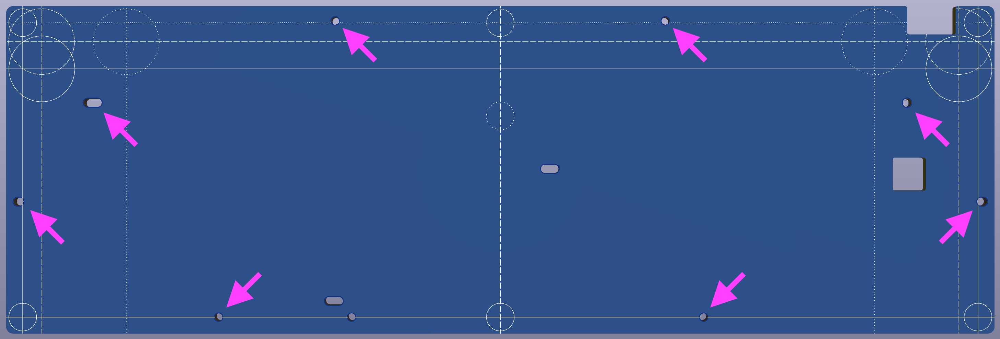

1. 組み合わせた基板をボトムプレートへ乗せ、ネジ穴とスペーサーの位置を合わせる

1. 基板Baseのおもて側から、ボトムプレートを3mmネジで止める（8箇所）

    ```text
    3mmネジ  
    ↓  
    －－ 基板Base －－  
    ↑  
    －－ ボトムプレート －－
    ```

    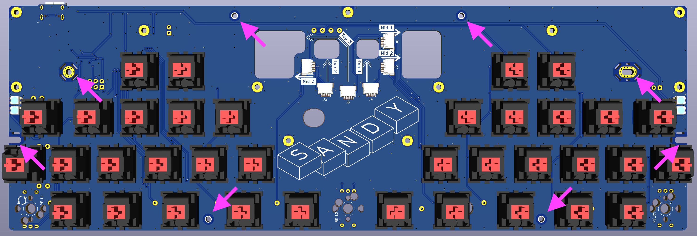

### （該当者のみ）ケースへ取り付ける

条件：ケースを使用する場合

1. 組み合わせた基板を、ケースへそっと入れる

1. 基板Baseおもて側からネジ止めする（左側2箇所、右側2箇所）

    中央と、中央右下のネジは使用しません。

    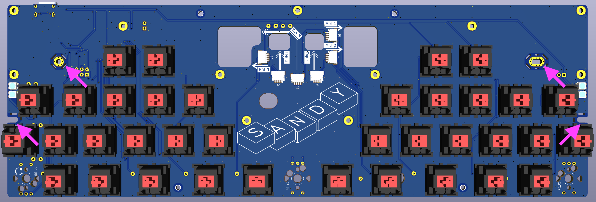

### キーキャップを取り付ける

1. キーキャップを取り付ける

以上で組み立て完了です。

## 参考資料

### 資料：初期ファームウェアの機能と設定値

出荷時に書き込まれている初期ファームウェアの機能と設定値を説明します。

- QMKバージョン

  0.18.17

- キーマップ書き換えツールのRemapに対応。

- レイヤー構成とレイヤーインジケータLEDの色  
  レイヤー0から7まで、8個のレイヤーが使用できます。  
  色が`－`の箇所は、元のレイヤー色が表示されます。

    | No. | レイヤー名 | 主なキー割り当て | レイヤーインジケータLEDの色<br>上, 下 |
    | :-: | :-- | :-- | :-: |
    | 0 | ベースレイヤー #1 | 英語配列 | 白, 白 |
    | 1 | ベースレイヤー #2 | ↑ | 青, 青 |
    | 2 | ベースレイヤー #3 | ↑ | 黄, 黄 |
    | 3 | Lower #1 | ファンクションキー<br>記号<br>オーディオコントロール | 緑, － |
    | 4 | Lower #2 | ↑ | 桃, － |
    | 5 | Raise #1 | ファンクションキー<br>数字<br>カーソル移動 | 水, － |
    | 6 | Raise #2 | ↑ | 橙, － |
    | 7 | Adjust | ベースレイヤー切り替え<br>LED等の設定<br>スクロールロックなど | 赤, － |
    | 番外| CapsLock | n/a | －, 紫 |

- ロータリーエンコーダ

  最大2個に対応。

  - 左側（RE_L1）と中央（RE_L2）のうち、いずれかひとつ

  - 右側（RE_R1）

- その他

  - ベースレイヤーを記憶させる

    キーボードの電源を切ってもベースレイヤーが記憶されるようにするには、  
    デフォルトレイヤー切り替えのキー `DF(0)`, `DF(1)`, `DF(2)` を `Shift` と組み合わせて押します。

    例えば、`Shift + DF(1)` を押すと `ベースレイヤー #2` へ切り替わると同時に、EEPROMへその情報が保存されます。
    EEPROMへ保存されているので、キーボードの電源を切っても、次回接続した際に`ベースレイヤー #2`の状態で起動します。

  - レイヤーインジケータの表示状態を切り替える

    レイヤーインジケータの表示は、  
    `左のみ` → `右のみ` → `左右両方` → `消灯` …  
    の4パターンへ切り替えることができます。

    表示状態を切り替えるには、`Adjust`レイヤーの`O（オー）`を押します。  
    なお、表示状態はEEPROMに保存されます。

  - レイヤーインジケータの明るさを調整する

    レイヤーインジケータの明るさは、RGB Lightingの明るさに合わせるように設定してあります。

    明るさを調整するには、  
    `Adjust`レイヤーの`L`を押してから、（一時的にRGB LightingをONにしてから、）  
    `Adjust`レイヤーの`I`と`K`で明るさを調整し、
    `Adjust`レイヤーの`L`を押します。（RGB LightingをOFFにします。）

### 資料：Sandy関連ファイル

このキーボードに関連するファイルです。  

- ビルド済みファームウェア（QMKバージョン 0.22.14）： sandy_dn0020_qmk_0.22.14_via.hex  
[Sandy_DN0020_files2](https://gist.github.com/jpskenn/3fba73c5b541e13f96ebbfbdbcda088c)（Zipファイルをダウンロードして展開）

    2023年9月11日に更新されたRemap（QMKバージョン 0.22.2以降版）に対応するファームウェアです。  
    機能的な変更はありません。

- ビルド済みファームウェア： sandy_dn0020_via.hex  
  [Sandy_DN0020_files](https://gist.github.com/jpskenn/f1980616959f451fd799d8fc0f839c91)（Zipファイルをダウンロードして展開）

    出荷時に書き込み済みのファームウェアです。  
    [Remap for QMK Firmware 0.18.17 or lower](https://qmk018.remap-keys.app)で、キーの割り当てを変更することができます。  
    ロータリーエンコーダへのキー割り当てをおこなうには、Remapで定義ファイル`sandy_v01_via.json`をインポートしてください。

- ファームウェアのソース

    私がQMKからフォークしたリポジトリ[https://github.com/jpskenn/qmk_firmware](https://github.com/jpskenn/qmk_firmware)の、[develop_Sandy](https://github.com/jpskenn/qmk_firmware/tree/develop_Sandy)ブランチ内、`keyboards/sandy/dn0030`に配置しています。  

    このブランチは、QMKバージョン 0.18.17から派生し、後にQMKバージョン 0.22.14をマージしています。

  - Tags
    - [Sandy_QMK_0.22.14](https://github.com/jpskenn/qmk_firmware/releases/tag/Sandy_QMK_0.22.14)
    - [Sandy_QMK_0.18](https://github.com/jpskenn/qmk_firmware/releases/tag/Sandy_QMK_0.18)

### 資料：QMK Toolboxを使用して、ファームウェアを書き込む方法

[QMK Toolbox](https://github.com/qmk/qmk_toolbox/releases)を使用してビルド済み（＝作成済み）のファームウェアを書き込む方法について説明します。  
（確認したQMK Toolboxのバージョン： 0.2.1）

<details>
<summary>《《《 詳しい説明 》》》</summary>

**ファームウェアを書き込んだ後に初めてRemapに接続した際、キーボードレイアウト画面が表示されるまで30秒〜1分ほどかかる場合があります。**  
EEPROMの初期化処理がおこなわれていますので、キーボードの準備が整うまでしばらくお待ちください。  
2回目以降の接続では、すぐに接続されます。

QMKファームウェアのドキュメント”[ファームウェアを書き込む](https://docs.qmk.fm/#/ja/newbs_flashing?id=ファームウェアを書き込む)”も、あわせてご覧ください。

1. [資料：Sandy関連ファイル](#資料sandy関連ファイル)に記載のダウンロード先から、ビルド済みのファームウェアをダウンロードします。

1. [QMK Toolbox](https://github.com/qmk/qmk_toolbox/releases)をダウンロードし、起動します。

1. `Open`ボタンを押し、QMK Toolboxで、ダウンロードしておいたファームウェアを開きます。

1. `Sandy`キーボードをDFU (Bootloader)モードにします。
    1. USBケーブルが接続されている場合は、ケーブルを抜きます。
    1. キーボードの**左上**のキー（`ESC`や`\``）を押したまま、USBケーブルを差し込みます。

1. QMK Toolboxの画面に、以下のような接続メッセージが表示されます。  
    （もし表示されない場合は、USBケーブルを接続した状態で、基板うら側のリセットボタンを押します）

    ```text
    *** Atmel DFU device connected: ATMEL ATm32U4DFU (03EB:2FF4:0000)
    ```

1. QMK Toolboxの`Flash`ボタンを押すとファームウェアの書き込みが始まります。  
    5秒程度で書き込みが終わり、QMK Toolboxの画面に以下のような書き込み完了メッセージが表示されます。（サイズ表記などの、細かい部分は実際とは異なります）

    ```text
    *** Attempting to flash, please don't remove device
    >>> dfu-programmer atmega32u4 erase --force
        Erasing flash...  Success
        Checking memory from 0x0 to 0x6FFF...  Empty.
    >>> dfu-programmer atmega32u4 flash --force /Users/jpskenn/qmk_firmware/nora_v01_via.hex
        0%                            100%  Programming 0x5E80 bytes...
        [>>>>>>>>>>>>>>>>>>>>>>>>>>>>>>>>]  Success
        0%                            100%  Reading 0x7000 bytes...
        [>>>>>>>>>>>>>>>>>>>>>>>>>>>>>>>>]  Success
        Validating...  Success
        0x5E80 bytes written into 0x7000 bytes memory (84.38%).
    >>> dfu-programmer atmega32u4 reset
    *** Atmel DFU device disconnected: ATMEL ATm32U4DFU (03EB:2FF4:0000)
    ```

    書き込み完了メッセージが表示されたら、QMK Toolboxを終了してもかまいません。  

    これとは違うメッセージ（書き込み失敗など）が表示された場合は、スクリーンショットを撮ったり、メッセージをコピーしておくと、何らかのサポートを受ける場合にスムースに話が進みます。

1. 書き込みが終わってから30秒程度でキーボードが起動し、キー入力できるようになります。  
  ファームウェアを書き込んだ後、初回起動時に外部EEPROMの消去をおこなっています。  
  この消去処理にしばらく時間がかかっています。

1. リセットボタンを使ってDFUモードにする操作をおこなった場合は、[資料：EEPROMを消去して、初期状態に戻す方法](#資料eepromを消去して初期状態に戻す方法)をおこないます。

以上でQMK Toolboxを使用したファームウェアの書き込み作業は完了です。

</details>

### 資料：EEPROMを消去して初期状態に戻す方法

EEPROMに記録されているデータを消去し、初期状態に戻す方法について説明します。  

<details>
<summary>《《《 詳しい説明 》》》</summary>

キーマップやLEDの表示モードなどのEEPROMに記録されているデータを消去し、初期状態に戻すことができます。  

また、古いデータが残って動作がおかしくなるのを防止するため、リセットボタンを使用してファームウェアを書き込んだ際にもこの操作をおこないます。

1. USBケーブルを接続している場合は、ケーブルを抜きます。

1. キーボードの左上のキーを押したまま、USBケーブルを差し込みます。

1. ケーブルを差し込んで、1、2と数えてから、USBケーブルを抜きます。

1. USBケーブルを差し込みます。

1. 10秒ほど待つとキーボードが起動します。

以上でEEPROMが消去され、初期状態に戻ります。

</details>

## サービスマニュアル

基板の準備やファームウェアの書き込みなど、出荷前の作業メモです。

<details>
<summary>《《《 詳しい説明 》》》</summary>

### パーツリスト

| 部品名 | 個数 | 備考 |
| :---- | :-----: | :---- |
| USBコネクタ<br>USB4085-GF-A または TYPE-C-31-M-12 | 1 | 製造により異なる |
| ESD<br>PRTR5V0U2X | 1 | 取り付け方向は基板の印を参照 |
| FUSE<br>0ZCJ0050AF2E | 1 ||
| リセットスイッチ<br>RS-187R05A2-DSMTRT | 1 ||

### 基板セットアップ

作業対象は基板Baseのみ

1. 部品取り付け

    1. 基板うらからUSBコネクタを取り付ける

        テスターでピン接続、ショートしないことを確認する。
        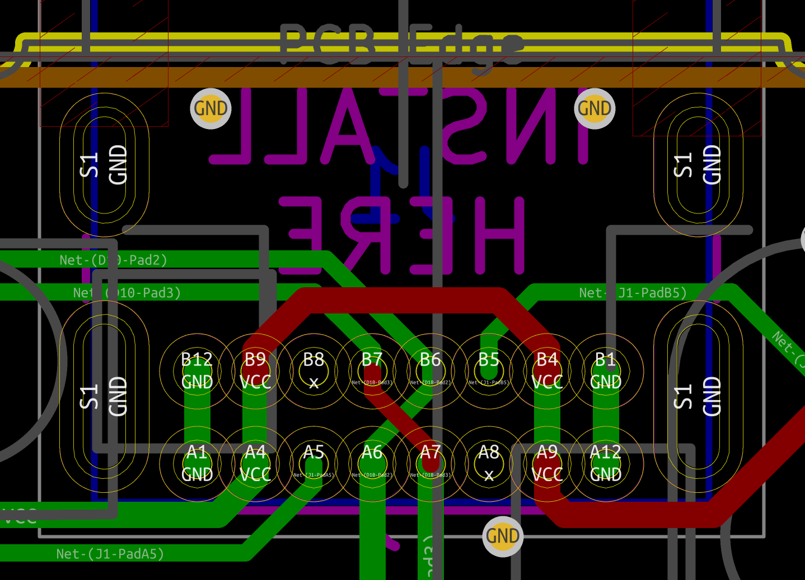  
        USBコネクタ接続図（USB4085-GF-A）

        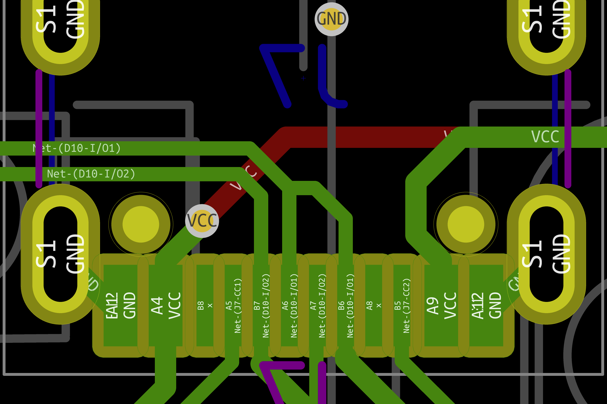  
        USBコネクタ接続図（TYPE-C-31-M-12）

    1. 基板うら側`D10`へESDを取り付ける

        基板に描かれた取り付け方向を参照

    1. 基板うら側`F1`へFUSEを取り付ける

        方向なし

    1. リセットスイッチを取り付ける

        方向なし

1. ファームウェア書き込み

    1. QMK Toolboxを起動して、書き込むファームウェアを開く

    1. 基板をPC/Macへ接続

        QMK Toolboxに、デバイスの接続メッセージが表示されることを確認。

    1. 基板のリセットスイッチを押す

        QMK Toolboxに、デバイスの切断と接続のメッセージが表示されることを確認。

    1. QMK Toolboxの`Flash`ボタンを押して書き込む

    1. Remapを開いて接続

        → EEPROMの初期化に1分ほどかかる

    1. Remapでスイッチソケットのパッドの反応を確認する

</details>
