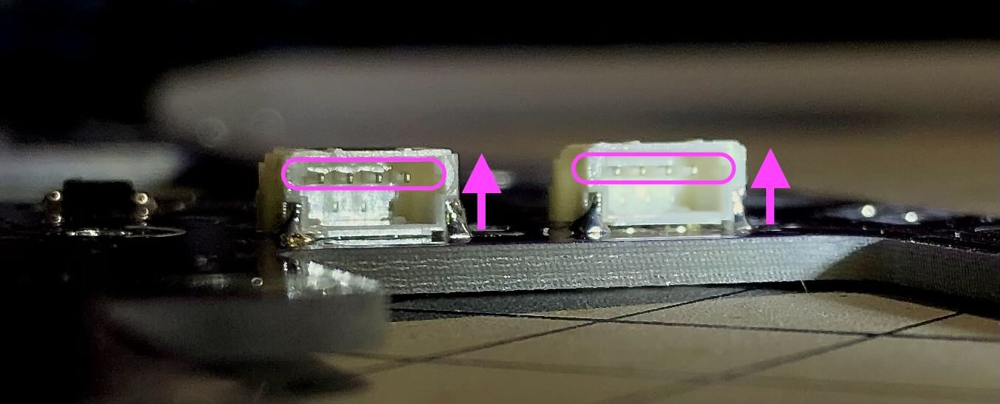

# Sandy（DN0030）ビルドガイド

このドキュメントは、Sandy（DN0030）を組み立てるためのビルドガイドです。

開発番号`DN0030`は、各基板のうら側に記載されています。


Sandyのコンセプトや特徴、ビルド例などについては、こちらの[README](/README.md)をご覧ください。

ビルドガイド全体に目を通して作業手順を把握しておくとミスの防止につながりますので、ぜひ、一度お読みになってから組み立て作業を始めてください。

折り畳まれた項目は、

<details>
<summary>《《《 詳しい説明 》》》</summary>

ここに追加の説明を表示します。
</details>

と書かれたところをクリックすると、追加の説明が表示されます。

---

## 目次

<!-- @import "[TOC]" {cmd="toc" depthFrom=2 depthTo=2 orderedList=false} -->

<!-- code_chunk_output -->

- [目次](#目次)
- [注意事項](#注意事項)
- [組み立て難易度](#組み立て難易度)
- [部品リスト](#部品リスト)
- [組み立てに使用する工具](#組み立てに使用する工具)
- [組み立て手順](#組み立て手順)
- [カスタマイズガイド](#カスタマイズガイド)
- [サービスマニュアル](#サービスマニュアル)

<!-- /code_chunk_output -->

## 注意事項

## 組み立て難易度

- 通常版キット： **★★★☆☆ ふつう**

    一般的なはんだ付けとネジ止めができれば、高度なテクニック不要で組み立てられます。  
    初めてキーボードキットを組み立てる方や不慣れな方にはちょっと難しいかもしれませんが、まぁなんとかなるでしょう。

- 通常版以外のキット： **★★★★☆ そこそこ難しい**

    コツをつかむまでは、SHコネクタの取り付けに苦労するでしょう。  
    はんだ付け作業自体は難しくありませんが、端子間隔が狭いため、はんだブリッジが起こりやすくなっています。  
    さらに、その箇所を目視確認するのも困難なため、テスターでの確認がほぼ必須となります。  
    はんだ付けを数回やった程度の方には、かなりチャレンジングな作業になると思われます。  

    なお、はんだブリッジが起きても修正すれば復旧できるので、致命傷ではありません。

## 部品リスト

このキットを組み立てるためには、[キット内容](#キット内容)に加え、[別途用意が必要な部品](#別途用意が必要な部品)が必要です。  

[オプション部品](#オプション部品)は、使いたい機能に応じて用意します。  

### キット内容

| 番号 | 部品名 | 個数 | 備考 |
| :--: | :-- | :--: | :-- |
| 1 | ご案内リーフレット | 1 | |
| 2 | 基板Base | 1 | |
| 3 | 基板Mid | 1 | |
| 4 | 基板Top | 1 | Mid用スイッチプレートを兼ねる |
| 5 | Base用スイッチプレート | 1 | 捨て基板（プレート外側の枠）を切り離して使用 |
| 6 | Top用スイッチプレート | 1 ||
| 7 | ボトムプレート | 1 ||
| 8 | JST SH 4pinケーブル<br>（いわゆるQwiicケーブル） | 6※ | ※1本をTop基板に取り付け済みの場合あり<br> [PRT-17260](https://www.digikey.jp/ja/products/detail/sparkfun-electronics/PRT-17260/13629028) |
| 9 | スペーサー<br>両メネジ M2 3mm | 16 | [ヒロスギ ASB-2003E](https://hirosugi.co.jp/products/B/ASB-E.html#bx3) |
| 10 | ナット<br>M2 2種 高さ1.6mm | 22 | [ウィルコ FNT-02N-2](https://wilco.jp/products/F/FNT-N-2.html) |
| 11 | ワッシャー<br>M2 内径2.3mm 外径4.3mm 厚さ0.4mm| 19 | [ウィルコ FW-0204-04N](https://wilco.jp/products/F/FW-N.html#page3) |
| 12 | ネジ<br>M2 3mm | 32 | [ウィルコ F-0230N-03](https://wilco.jp/products/F/F-N-02.html#page3) |
| 13 | ネジ<br>M2 7mm | 11 | [ウィルコ F-0270N-03](https://wilco.jp/products/F/F-N-02.html#page3) |
| 14 | ゴム足（大） | 2 | [KKU-122]() |
| 15 | ゴム足（小） | 3 | [CS-102](https://www.3mcompany.jp/3M/ja_JP/p/d/v000453068/) |
| 16 | LED<br>SK6812MINI-E | 2 | [マイコン内蔵ＲＧＢＬＥＤ　ＳＫ６８１２ＭＩＮＩ－Ｅ](https://akizukidenshi.com/catalog/g/gI-15478/) |
| 17 | スイッチ用ソケット<br>（MXスイッチ用） | 68 | 予備含む<br>[MXスイッチ用 Kailh PCBソケット](https://talpkeyboard.net/items/5e02c5405b120c792616bcf9) |
| 18 | SHコネクタ<br>JST SH ベース サイド型 4pin 面実装 | (6) | 通常版以外のキットに付属<br>[SM04B-SRSS-TB(LF)(SN)](https://www.lcsc.com/product-detail/_JST-Sales-America-_C160404.html) |

※出荷時期によって、機能的に同等なものへ変更することがあります。

  
基板3枚。  
上から順に、基板Top、基板Mid、基板Base。

  
プレート類。  
上から順に、Top用スイッチプレート、Base用スイッチプレート、ボトムプレート。

〓写真　部品すべて（番号つける）

### 別途用意が必要な部品

完成させるには、これらの部品を別途用意する必要があります。

| 部品名 | 個数 | 備考 |
| :-- | :--: | :-- |
| Cherry MX（互換）スイッチ | 66〜最大67 | 3pin、5pinどちらにも対応。<br>組み立てるレイアウトにより使用数が変動します。 |
| キーキャップ<br>Cherry MX（互換）スイッチ用 | 必要数 | 英語104キーキャップセットにスペースキー用として1.5uのキー2個を追加すると、ぴったり埋めることができます。<br>バラ売りのブランクDSAキーキャップなどを追加したり、1.5uのALTキーなどが含まれるセットを購入すると良いでしょう。<br>日本語108キーキャップセットはBSキーとして使う1.5uキーが足りないため、おすすめしません。<br>参考： [Sandy（DN0030）のレイアウト](http://www.keyboard-layout-editor.com/#/gists/c907e866d8f82b82a22b455e622b7301) |
| USBケーブル （Type-C） | 1 | |

### オプション部品

これらの部品は、使いたい機能に応じて用意します。

| 部品名 | 個数 | 備考 |
| :-- | :--: | :-- |
| ロータリーエンコーダ<br>ALPS EC11, EC12同等品 | 1 | ロータリーエンコーダを使用する場合<br>プッシュスイッチ付きにも対応<br><br>取り付け確認済みのロータリーエンコーダは以下の通りです。<br>- EC12E24204A2<br>- EC11K1525401 |
| ロータリーエンコーダ用ノブ（つまみ） | 1 | ロータリーエンコーダを使用する場合 |
| LED<br>SK6812MINI-E | 16 | アンダーグローLEDを取り付ける場合<br>[マイコン内蔵ＲＧＢＬＥＤ　ＳＫ６８１２ＭＩＮＩ－Ｅ](https://akizukidenshi.com/catalog/g/gI-15478/) |
| GH60型ケース | 1 | ボトムプレートを使わず、ケースへ取り付ける場合。<br><br>ケースへの固定には、中央と中央下のネジは使用しません。左右2本ずつ、合計4本のネジだけで取り付けます。<br>すべてのGH60型ケースへの対応を確認していないため、ケース内部の構造によっては取り付けに加工が必要になったり、取り付けできないことも考えられます。<br><br>取り付け確認済みのケースは以下の通りです。<br>- KBDfans TOFU 60% ALUMINUM CASE<br>- KBDfans 5° FIVE DEGREE 60% ALUMINUM CASE<br>- 60% プラスチックケース（簡単な加工が必要） |

## 組み立てに使用する工具

こちらの[工具セット](https://shop.yushakobo.jp/products/a9900to)などを参考に、工具を用意します。

- 必要な工具

  - M2ネジに対応する、先の細いプラスドライバー（+0）

    スイッチとスイッチの間などに差し込みやすい”細軸タイプ”がおすすめ。

  - はんだ付け関連用品

    はんだ小手は、温度調整機能つきのものを推奨します。

  - ピンセット

- あると便利な工具

  - マジックペン

    基板の側面を塗ると、完成時の質感が上がります。  
    暗めの色を塗る場合は[プロッキー](https://www.mpuni.co.jp/products/felt_tip_pens/water_based/sign_pen/prockey.html)を、明るめの色を塗る場合は不透明顔料インクの[ポスカ](https://www.mpuni.co.jp/products/felt_tip_pens/water_based/posca/standard.html)を使うなど、お好みで。

    太字角芯と極細をそれぞれ用意しておくと作業がはかどります。

  - M2ナット対応のレンチ，ナットドライバー

    ナットを締める箇所が多いので、あると作業が格段に楽になります。  
    [タミヤ SP.38 工具セット](https://www.tamiya.com/japan/products/50038/index.html)の十字レンチが安くておすすめ。

  - カッター，はさみ

    捨て基板（捨て板）のミシン目に切り込みを入れて、切り離しやすくします。

  - ニッパー

    ケースへ取り付ける場合、ケース内部の構造によっては、スイッチの足やケース内のリブをカットする必要があるかもしれません。

  - テスター

    はんだ付けの確認作業や、何か不具合があった場合の原因調査で活躍します。  
    **通常版以外のキットでSHコネクタを取り付ける場合は、ほぼ必須。**

  - フラックスやハンダ吸い取り線

    小さな部品のはんだ付けや修正、部品の取り外しなどがしやすくなります。

## 組み立て手順

手順に沿って、順番に組み立てます。

- `（こだわり作業）`の手順は、完成時の質感を重視した内容であり、不要であれば作業をとばしてもかまいせん。

  💡ヒント：組み立て後は一旦分解してからの作業となるため、どうせやるなら、最初からやってしまう方が楽です。

- `（該当者のみ）`の手順は、条件に該当する場合のみ作業します。

- おもて側とうら側を間違えないよう、基板うら側の`Back Side`の表記を確認しながら作業を進めます。

  

### 組み立て前の確認

輸送時の破損なども考えられるため、組み立てを始める前に基板Baseの動作確認をおこないます。  
確認結果に問題がある場合は、リーフレットに記載の連絡先へ相談してください。

1. 基板Baseを、うら側を上にして安定した場所へ置く

1. 基板BaseのUSBコネクタへケーブルを差し込み、PCやMacに接続する

1. PCやMacで認識されていることを確認する

    - Windows  
      設定 → キーボード  
      ”Sandy”が表示されていること

    - Mac  
      システムレポート → USB  
      ”Sandy”が表示されていること

1. [Remap](https://remap-keys.app/)を、対応するブラウザ（ChromeやEdgeなど）で開く

1. キーボードをRemapに接続する

    1. `START REMAP FOR YOUR KEYBOARD`
    1. `+ KEYBOARD`
    1. `Sandy`を選択
    1. `接続`

1. 画面にキーボードのレイアウトが表示されるまでしばらく待つ。

    30秒待っても表示されないときは、ブラウザをリロードしてやり直す。

1. "Layout Option"で以下のようにレイアウトを指定する

    - Left Shift: 1u + 1u
    - Bottom Keys: 5 keys
    - Rotary Encoder, Left / Center: Off
    - Rotary Encoder, Right: Off
    - 5-way navigation: Off

1. ”Test Matrix Mode”を開く

1. キースイッチの反応を確認する

    基板Baseうら側のスイッチソケット取り付け用パッド（銀色の四角い端子部分）をピンセットなどでショートさせ、ブラウザ画面上の対応するキーの色が変わることを確認します。

    

### 組み立てるレイアウトを決める

以下のポイントを念頭に、組み立てるレイアウトを決めます。

- キーのサイズ

  - Control（左）：1.25u または 1.5u

  - Enter（右）：1.25u または 1.5u

- ロータリーエンコーダの有無

  - 中央（RE_L2）

参考：[Sandyのレイアウト](http://www.keyboard-layout-editor.com/#/gists/c907e866d8f82b82a22b455e622b7301)

### Base用スイッチプレートの準備

1. プレート上部の捨て基板（プレート外側の枠）をミシン目に沿って切り離す

    プレート本体を破損しないように注意しながら、折り取るようにして切り離します。  
    💡ヒント：ミシン目をカッターやはさみで10-20回ほどなぞって切れ込みを入れると折りやすくなります。

    

    切り離した箇所が尖っていることがあるので、怪我をしないように気をつけます。

    

### （こだわり作業）基板側面をマジックで塗る

完成時の質感を高めるため、基板、プレートの側面をマジックで塗ります。

上：基板そのままの色，下：プロッキーの紫で塗った色


### 基板Topの準備

1. うら側から、スイッチ用ソケットを取り付ける（19個）

    基板に描かれた枠に合わせてソケットを取り付けます。  
    はんだ小手を270度くらいにセットして、はんだ付けします。  
    

    ソケットが基板から浮かないように注意します。
    

1. 方向を合わせて、コネクタへケーブルを差し込む（3本）

    うら側（`Top1`, `Top2`, `Top3`）。  
    出荷ロットによっては、`Top3`にケーブルを取り付け済みの場合があります。

    **ケーブルの端子側が上**になるように、方向を合わせて差し込みます。  
    コネクタが基板からもげてしまわないように、上から押さえたり後ろを支えたりしながらケーブルを差し込むと安心です。

    

    

    

### 基板Midの準備

1. うら側から、スイッチソケットを取り付ける（13個）

1. おもて側から、ワッシャーを挟んだナットを7mmネジでとめる（11箇所）

    ナットを締め込みすぎないよう、グイグイ・グググッと締め込むのではなく、ナットを回して最初にククッと止まったところでやめます。

    ```text
    7mmネジ  
    ↓  
    ーー 基板Mid ーー  
    ↓  
    ワッシャー  
    ↓  
    ナット
    ```

    

    💡ヒント：ネジ穴に印がついている側から、ネジを差し込みます。  
      

    

1. うら側から、ワッシャーを挟んだスペーサーを3mmネジでとめる（8箇所）

      ```text
      スペーサー  
      ↑
      ワッシャー  
      ↑
      ーー 基板Mid ーー  
      ↑
      3mmネジ  
      ```

    

    

1. 方向を合わせて、コネクタへケーブルを差し込む（3本）

    うら側（`Mid1`, `Mid2`, `Mid3`）

    

### 基板Baseの準備

1. うら側から、スイッチソケットを取り付ける（34〜35個）

    Control（左）とEnter（右）は、使用するキーのサイズに合わせて`1.25u`または`1.5u`のどちらかにソケットを取り付けます。  
    ロータリーエンコーダを取り付ける場合は、その場所にソケットを取り付ける必要はありません。

    最下行の左右端から2個ずつ、×マークのついた箇所には取り付けません。

    

1. （該当者のみ）うら側から、インジケータLEDを取り付ける（2個）

    条件：インジケータLEDを使用する場合

    うら側（`L1`, `L2`）

    基板に描かれた印にLEDの端子の切り欠き部分を合わせてはめこみ、220度程度の温度ではんだ付けします。  
    （はんだが溶けにくい場合は、270度で短時間の作業をおこないます）

    

    PCやMacに接続し、インジケータLED2個が白色に点灯することを確認します。

    

1. （該当者のみ）おもて側から、アンダーグローLEDを取り付ける（16個）

    条件：アンダーグローLEDを使用する場合

    おもて側（`L3` ... `L18`）

    PCやMacに接続し、アンダーグローLEDがすべて赤色に点灯することを確認します。

    

1. （該当者のみ）おもて側から、SHコネクタを取り付ける（6個）

    条件：通常版以外のキットを組み立てる場合

    おもて側（`J1` ... `J6`）

    基板に描かれた枠に合わせてはんだ付けします。  
    

    まず、大きなパッドの片方だけに予備はんだしておきます。  
    コネクタの位置を枠に合わせ、仮固定します。  
    正しい位置に仮固定できたら、もう片方のパッドと4本のピンをはんだ付けします。  
    隣同士の端子がはんだで繋がっていないか目視確認し、可能であれば、テスターで隣同士の端子が同通しないことも確認しておきます。  
    端子にプローブを当てるのが難しい場合は、コネクタのうら側にあるスルーホールで確認することもできます。

1. （該当者のみ）おもて側から、ロータリーエンコーダを取り付ける

    条件：ロータリーエンコーダを使用する場合

    おもて側（`RE_L2`）

    おもて側からはめ込んで、うら側からはんだ付けします。

    

### 各基板をひとつに組み合わせる

1. 基板Midのケーブルを、基板Baseのコネクタへ、方向を合わせて差し込む

    コネクタ`Mid1`, `Mid2`, `Mid3`同士を接続します。

    **ケーブルの端子側が上**になるように、方向を合わせて差し込みます。  
    💡ヒント：ケーブルを1回ひねって方向を合わせるようにします。

    

1. ケーブルを基板の隙間や、Base基板の穴からうら側へ逃しながら、基板Midを基板Baseへ乗せ、ネジ穴へはめ込む

    ケーブルを挟んだり、無理な力がかからないように注意します。

    11箇所のネジが、きっちりとネジ穴にはまっていることを確認します。

1. 基板Baseと基板Midを仮固定する（全11箇所のうち3箇所程度）

    基板Baseのうら側から、基板Midのネジをナットで止めます。  
    💡ヒント：後工程の確認作業が完了するまでは、3箇所だけ仮固定した状態で作業を進めます。

    ```text
    －－ 基板Mid －－  
    ↓  
    －－ 基板Base －－  
    ↑  
    ナット
    ```

    ケーブルを基板Baseの穴から出して逃し、3箇所だけ仮固定した様子
    

1. 基板Topのケーブルを、基板Baseのコネクタへ、方向を合わせて差し込む

    コネクタ`Top1`, `Top2`, `Top3`同士を接続します。

    

1. ケーブルを基板の隙間や基板Baseのうら側へ逃しながら、基板Topを基板Midへ乗せ、ネジ穴へはめ込む

1. 基板Topのおもて側から、基板Midを3mmネジで止める（8箇所）

    ```text
    3mmネジ  
    ↓  
    －－ 基板Top －－  
    ↑  
    －－ 基板Mid －－
    ```

    組み合わせた基板（おもて側）
    

    組み合わせた基板（うら側コネクタ部分）
    

### スイッチを取り付ける

スイッチの端子が曲がっていないことを確認してから、プレートを介して基板へまっすぐ押し込んで取り付けます。  

```text
スイッチ  
↓  
－－ プレート －－  
↓  
－－ 基板 －－
```

スイッチがプレートにぴったりはまるように取り付けます。


以下の写真は、スイッチの爪でプレートが押し下げられた不正な状態です。  
プレートを指で持ち上げて、スイッチをプレートにぴったりとはめ込みます。


1. 基板Midのスイッチを、基板TopのMid用スイッチプレートを介して取り付ける

1. 基板Topのスイッチを、Top用スイッチプレートを介して取り付ける

1. 基板Baseのスイッチを、Base用スイッチプレートを介して取り付ける

    以下のスイッチは上下反対に取り付けます。

    - 下から2行目の左端
    - Control（左）※1.5uを使用する場合
    - Enter（右）※1.5uを使用する場合

    すべてのスイッチを取り付けた様子
    

### 動作確認をおこない、基板を完全固定する

1. Remapの”Test Matrix Mode”を使用して、すべてのキースイッチが正常に反応するか確認する

    異常がある場合は、原因を調査して修正します。

1. 基板Baseのうら側から、基板Midのすべてのネジをナットで固定する（11箇所）

### （該当者のみ）ボトムプレートへ取り付ける

条件：ボトムプレートを使用する場合

1. ボトムプレートのうら側から、スペーサーを3mmネジでとめる（8箇所）

      ```text
      スペーサー  
      ↑
      ーー ボトムプレート ーー  
      ↑
      3mmネジ  
      ```

    

    

1. 組み合わせた基板をボトムプレートへ乗せ、ネジ穴とスペーサーの位置を合わせる

    ケーブルをネジで挟んだり、無理な力がかからないように気をつけます。

1. 基板Baseのおもて側から、ボトムプレートを3mmネジで止める（8箇所）

    ```text
    3mmネジ  
    ↓  
    －－ 基板Base －－  
    ↑  
    －－ ボトムプレート －－
    ```

    

1. ボトムプレートのうら側から、ゴム足を貼り付ける。

### （該当者のみ）ケースへ取り付ける

条件：ケースを使用する場合

1. 組み合わせた基板を、ケースへ入れる

    基板の手前側を持ち、ケースに対して30度くらいの角度にします。  
    基板の奥の方からケースに差し込むようにし、USBコネクタをケースの穴にはめます。  
    手前側をそっと下ろします。

1. 基板Baseおもて側からネジ止めする（左側2箇所、右側2箇所）

    

### キーキャップを取り付ける

1. キーキャップを取り付ける

1. （該当者のみ）ロータリーエンコーダのノブを取り付ける

    条件：ロータリーエンコーダを使用する場合

以上で組み立て完了です。


自分好みのキーマップにカスタマイズして、お使いください。

---

## カスタマイズガイド

### 部分的にキーの高さを変え、さらに3D的に最適化する

キーの物理レイアウトを、さらに3D的に最適化する方法です。

<details>
<summary>《《《 詳しい説明 》》》</summary>

一般的なMX（互換）スイッチよりも高さが3mm程度低いスイッチが販売されています。  
このようなスイッチを使用することで、部分的にキーの高さを低くすることができます。  
（逆の発想として、低いスイッチを全体的に使って、普通のスイッチを部分的に使用すれば、部分的にキーの高さを高くできます）

  
E, D, Cに低いスイッチを使用した例

製品例：

- [TECSEE Pudding ミディアムリニアスイッチ](https://talpkeyboard.net/items/63c7d52e791d021b06ee47fa)
- [TECSEE Pudding ミディアムタクタイルスイッチ](https://talpkeyboard.net/items/63e60a1134e0177ea5ea1fb4)

</details>

### 打鍵感を柔らかくする（実験的）

ボトムプレートの取り付け方法を変えて、打鍵感を柔らかくする方法を紹介します。  
まだ長期間使い込んでいないため、**実験的**な情報提供となります。

<details>
<summary>《《《 詳しい説明 》》》</summary>

通常の組み立て手順では、ボトムプレートはスペーサーとネジで基板Baseに固定します。  
あまりガチガチに固定されない位置にネジを配置していますが、場合によっては打鍵感が硬く感じられることもあるでしょう。

こういった場合、スペーサーとネジを使わず、耐震ジェルを使ってボトムプレートを取り付けると打鍵感を柔らかくすることができます。  
Base基板のうら側、ソケットの間などへ耐震ジェルを貼り付け、ボトムプレートを重ねます。

  
耐震ジェル貼り付け例（少し貼りすぎたので、後で長いジェルを剥がしました）

耐震ジェルを貼りすぎるとプニプニ感が減って柔らかさが出にくいので、好みに合わせて調整してください。

製品例：

- [北川工業 TF-10100CL-3 タックフィット 細幅タイプ 10mm×100mm 6本入り 目安耐荷重：1本あたり7kg](https://www.yodobashi.com/product-detail/100000001007168728/)

ふと思いついたアイデアですが、今のところ実用面で特に問題もないため、情報共有します。

</details>

### キーボードの傾きを調整する

キーボードの傾きを自分に好みに合わせて調整する方法です。

<details>
<summary>《《《 詳しい説明 》》》</summary>

Sandyはそれ自体にキーの段差が組み込まれているため、キーボードの傾きを大きくつける必要がありません。  
そのため、奥側に取り付けるゴム足は低めのものを付属させています。

キーボードの傾きには個人の好みがあるので、ゴム足の高さを変えて好みの傾きに調整してください。

製品例：

- 高め：8.7mm

    [光 HIKARI KKU-190 ウレタンクッション19丸 透明](https://www.yodobashi.com/product-detail/100000001001980663/)

- ちょい高：5mm

    [光 HIKARI KKU-120 ウレタンクッション12mm角 透明](https://www.yodobashi.com/product-detail/100000001001980660/)

- キット付属品と同等：4.2mm

    [光 HIKARI KKU-122 ウレタンクッション12.8丸 透明](https://www.yodobashi.com/product/100000001001980661/)

</details>

### 基板の振動を抑える

不快な振動を感じる際の対処方法を紹介します。

<details>
<summary>《《《 詳しい説明 》》》</summary>

基板Base、基板Mid、基板Topそしてボトムプレートの4枚は、それぞれ8本または11本のスペーサーやネジでしっかりと固定されていますが、場合によっては不快な振動が発生する場合があります。<br>

このような場合は、適当な厚さのPORON（ポロン）シートを基板に貼り付けることで、振動を抑制することができます。

製品例：

- [イノアックL24-350-MT マイクロセルウレタンロールPORON 黒 3×50mm×1M巻](https://www.yodobashi.com/product/100000001004002496/)
- [イノアック L32-1.550-MT マイクロセルウレタンロールPORON 黒 1.5×50mm×1M巻](https://www.yodobashi.com/product/100000001004002516/)

</details>

## サービスマニュアル

### 初期ファームウェアの機能と設定値

出荷時に書き込まれている初期ファームウェアの機能と設定値を説明します。

<details>
<summary>《《《 詳しい説明 》》》</summary>

- QMKバージョン

  0.18.17

- キーマップ書き換えツールのRemapに対応。

- レイヤー構成とレイヤーインジケータLEDの色  
  レイヤー0から7まで、8個のレイヤーが使用できます。  
  色が`－`の箇所は、元のレイヤー色が表示されます。

    | No. | レイヤー名 | 主なキー割り当て | レイヤーインジケータLEDの色<br>上, 下 |
    | :-: | :-- | :-- | :-: |
    | 0 | ベースレイヤー #1 | SemiErgo 英語配列 | 白, 白 |
    | 1 | ベースレイヤー #2 | 一般的なロースタッガード 英語配列 | 青, 青 |
    | 2 | ベースレイヤー #3 | ↑ | 黄, 黄 |
    | 3 | Lower #1 | ファンクションキー<br>記号<br>オーディオコントロール | 緑, － |
    | 4 | Lower #2 | ↑ | 桃, － |
    | 5 | Raise #1 | ファンクションキー<br>数字<br>カーソル移動 | 水, － |
    | 6 | Raise #2 | ↑ | 橙, － |
    | 7 | Adjust | ベースレイヤー切り替え<br>LED等の設定<br>スクロールロックなど | 赤, － |
    | 番外| CapsLock | n/a | －, 紫 |

- ロータリーエンコーダ

  1個に対応。

  - 中央（RE_L2）

- アンダーグローLED

  16個のアンダーグローLEDに対応。

- その他

  - ベースレイヤーを記憶させる

    キーボードの電源を切ってもベースレイヤーが記憶されるようにするには、  
    デフォルトレイヤー切り替えのキー `DF(0)`, `DF(1)`, `DF(2)` を `Shift` と組み合わせて押します。

    例えば、`Shift + DF(1)` を押すと `ベースレイヤー #2` へ切り替わると同時に、EEPROMへその情報が保存されます。
    EEPROMへ保存されているので、キーボードの電源を切っても、次回接続した際に`ベースレイヤー #2`の状態で起動します。

  - レイヤーインジケータの表示状態を切り替える

    レイヤーインジケータの表示状態は、表示または非表示に切り替えることができます。

    表示状態を切り替えるには、`Adjust`レイヤーの`O（オー）`を押します。  
    なお、表示状態はEEPROMに保存されます。

  - レイヤーインジケータの明るさを調整する

    レイヤーインジケータの明るさは、RGB Lightingの明るさに合わせるように設定してあります。

    明るさを調整するには、  
    `Adjust`レイヤーの`L`を押してから、（一時的にRGB LightingをONにしてから、）  
    `Adjust`レイヤーの`I`と`K`で明るさを調整し、
    `Adjust`レイヤーの`L`を押します。（RGB LightingをOFFにします。）

  - アンダーグローの表示状態を切り替える

    アンダーグローの表示状態は、表示または非表示に切り替えることができます。

    表示状態を切り替えるには、`Adjust`レイヤーの`L`を押します。  
    なお、表示状態はEEPROMに保存されます。

</details>

### Sandy関連ファイル

このキーボードに関連するファイルです。  

<details>
<summary>《《《 詳しい説明 》》》</summary>

- ビルド済みファームウェア： sandy_v01_via.hex  
[Sandy_DN0030_files](https://gist.github.com/jpskenn/916b2abc9b1252dcd62130175d11db3e)（Zipファイルをダウンロードして展開）

- ファームウェアのソース  
  私がQMKからフォークしたリポジトリ [https://github.com/jpskenn/qmk_firmware](https://github.com/jpskenn/qmk_firmware)の、QMKバージョン0.18.17から派生した[develop_Sandy](https://github.com/jpskenn/qmk_firmware/tree/develop_Sandy)ブランチ内、`keyboards/sandy/dn0030`に配置しています。  
  Sandy DN0030のファームウェアは、[Sandy_DN0030タグ](https://github.com/jpskenn/qmk_firmware/releases/tag/Sandy_DN0030)を参照してください。

- 基板等の設計ファイルやドキュメント、Remapの定義ファイルなどは、[Sandyリポジトリ](https://github.com/jpskenn/Sandy)の[DN0030タグ](https://github.com/jpskenn/Sandy/releases/tag/DN0030)にまとめてあります。

</details>

### QMK Toolboxを使用して、ファームウェアを書き込む方法

[QMK Toolbox](https://github.com/qmk/qmk_toolbox/releases)を使用してビルド済み（＝作成済み）のファームウェアを書き込む方法について説明します。  

<details>
<summary>《《《 詳しい説明 》》》</summary>

（確認したQMK Toolboxのバージョン： 0.2.1）

**ファームウェアを書き込んだ後に初めてRemapに接続した際、キーボードレイアウト画面が表示されるまで30秒〜1分ほどかかる場合があります。**  
EEPROMの初期化処理がおこなわれていますので、キーボードの準備が整うまでしばらくお待ちください。  
2回目以降の接続では、すぐに接続されます。

QMKファームウェアのドキュメント”[ファームウェアを書き込む](https://docs.qmk.fm/#/ja/newbs_flashing?id=ファームウェアを書き込む)”も、あわせてご覧ください。

1. [資料：Sandy関連ファイル](#資料sandy関連ファイル)に記載のダウンロード先から、ビルド済みのファームウェアをダウンロードします。

1. [QMK Toolbox](https://github.com/qmk/qmk_toolbox/releases)をダウンロードし、起動します。

1. `Open`ボタンを押し、QMK Toolboxで、ダウンロードしておいたファームウェアを開きます。

1. `Sandy`キーボードをDFU (Bootloader)モードにします。
    1. USBケーブルが接続されている場合は、ケーブルを抜きます。
    1. キーボードの**左上**のキー（`ESC`や`\``）を押したまま、USBケーブルを差し込みます。

1. QMK Toolboxの画面に、以下のような接続メッセージが表示されます。  
    （もし表示されない場合は、USBケーブルを接続した状態で、基板うら側のリセットボタンを押します）

    ```text
    *** Atmel DFU device connected: ATMEL ATm32U4DFU (03EB:2FF4:0000)
    ```

1. QMK Toolboxの`Flash`ボタンを押すとファームウェアの書き込みが始まります。  
    5秒程度で書き込みが終わり、QMK Toolboxの画面に以下のような書き込み完了メッセージが表示されます。（サイズ表記などの、細かい部分は実際とは異なります）

    ```text
    *** Attempting to flash, please don't remove device
    >>> dfu-programmer atmega32u4 erase --force
        Erasing flash...  Success
        Checking memory from 0x0 to 0x6FFF...  Empty.
    >>> dfu-programmer atmega32u4 flash --force /Users/jpskenn/qmk_firmware/nora_v01_via.hex
        0%                            100%  Programming 0x5E80 bytes...
        [>>>>>>>>>>>>>>>>>>>>>>>>>>>>>>>>]  Success
        0%                            100%  Reading 0x7000 bytes...
        [>>>>>>>>>>>>>>>>>>>>>>>>>>>>>>>>]  Success
        Validating...  Success
        0x5E80 bytes written into 0x7000 bytes memory (84.38%).
    >>> dfu-programmer atmega32u4 reset
    *** Atmel DFU device disconnected: ATMEL ATm32U4DFU (03EB:2FF4:0000)
    ```

    書き込み完了メッセージが表示されたら、QMK Toolboxを終了してもかまいません。  

    これとは違うメッセージ（書き込み失敗など）が表示された場合は、スクリーンショットを撮ったり、メッセージをコピーしておくと、何らかのサポートを受ける場合にスムースに話が進みます。

1. 書き込みが終わってから30秒程度でキーボードが起動し、キー入力できるようになります。  
  ファームウェアを書き込んだ後、初回起動時に外部EEPROMの消去をおこなっています。  
  この消去処理にしばらく時間がかかっています。

1. リセットボタンを使ってDFUモードにする操作をおこなった場合は、[資料：EEPROMを消去して、初期状態に戻す方法](#資料eepromを消去して初期状態に戻す方法)をおこないます。

以上でQMK Toolboxを使用したファームウェアの書き込み作業は完了です。

</details>

### EEPROMを消去して初期状態に戻す方法

EEPROMに記録されているデータを消去し、初期状態に戻す方法について説明します。  

<details>
<summary>《《《 詳しい説明 》》》</summary>

キーマップやLEDの表示モードなどのEEPROMに記録されているデータを消去し、初期状態に戻すことができます。  

また、古いデータが残って動作がおかしくなるのを防止するため、リセットボタンを使用してファームウェアを書き込んだ際にもこの操作をおこないます。

1. USBケーブルを接続している場合は、ケーブルを抜きます。

1. キーボードの左上のキーを押したまま、USBケーブルを差し込みます。

1. ケーブルを差し込んで、1、2と数えてから、USBケーブルを抜きます。

1. USBケーブルを差し込みます。

1. 10秒ほど待つとキーボードが起動します。

以上でEEPROMが消去され、初期状態に戻ります。

</details>

### 基板準備作業メモ

基板の出荷準備作業に関するメモです。

<details>
<summary>《《《 詳しい説明 》》》</summary>

#### パーツリスト

| 部品名 | 個数 | 備考 |
| :---- | :-----: | :---- |
| USBコネクタ<br>TYPE-C-31-M-12 | 1 | |
| ESD<br>PRTR5V0U2X | 1 | 取り付け方向は基板の印を参照 |
| FUSE<br>0ZCJ0050AF2E | 1 ||
| リセットスイッチ<br>RS-187R05A2-DSMTRT | 1 ||
| SHコネクタ<br>JST SH ベース サイド型 4pin 面実装<br>[SM04B-SRSS-TB(LF)(SN)](https://www.lcsc.com/product-detail/_JST-Sales-America-_C160404.html) | 6 ||

#### 基板セットアップ

作業対象は基板Baseのみ。

1. SMTAしていない部品を取り付ける

    1. 基板うら側`J7`へUSBコネクタを取り付ける

        テスターで各ピンがショートしていないことを確認する。

          
        USBコネクタ接続図（TYPE-C-31-M-12）

    1. 基板うら側`D99`へESDを取り付ける

        基板に描かれた取り付け方向を参照

    1. 基板うら側`F1`へFUSEを取り付ける

        方向なし

    1. 基板うら側`ResetSW`へリセットスイッチを取り付ける

        方向なし

    1. 基板うら側`JP1`を、`Front`側にジャンパする。

        - `Front`
            インジケータ（2個）→アンダーグロー（16個）のLED配線。  
        - `Under`
            アンダーグロー（16個）のみのLED配線。

    1. 基板おもて側`J1`...`J6`へコネクタを取り付ける

        テスターで隣同士の端子がショートしていないか確認する。

1. ファームウェアを書き込む

    1. QMK Toolboxを起動して、書き込むファームウェアを開く

    1. 基板をPC/Macへ接続

        QMK Toolboxに、デバイスの接続メッセージが表示されることを確認。

    1. 基板のリセットスイッチを押す（リセットスイッチの動作確認も兼ねる）

        QMK Toolboxに、デバイスの切断と接続のメッセージが表示されることを確認。

    1. QMK Toolboxの`Flash`ボタンを押して書き込む

    1. Remapを開いて接続

        → EEPROMの初期化に1分ほどかかる

    1. Remapでスイッチソケットのパッドの反応を確認する

</details>
