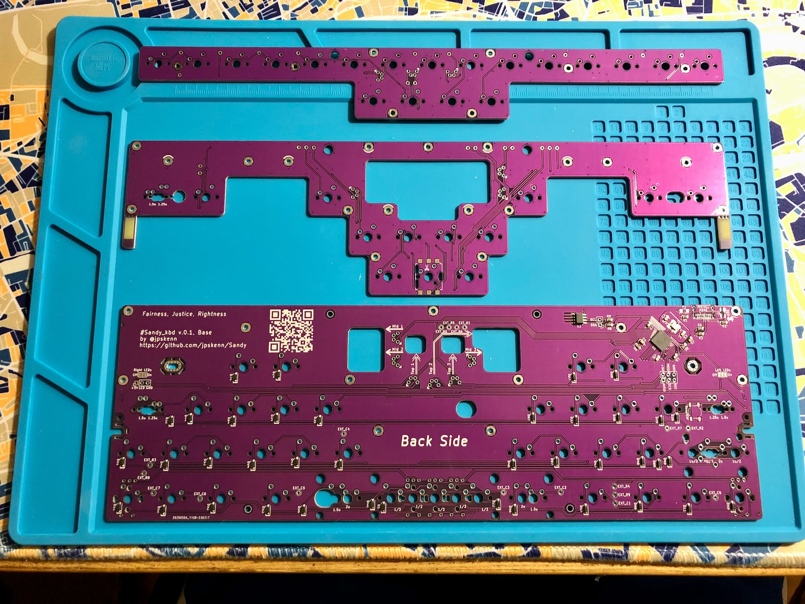

# Sandy v.0.1 ビルドガイド

このドキュメントは、Sandy v.0.1を組み立てるためのビルドガイドです。  
Sandyのコンセプトや特徴、ビルド例などについては、こちらの[README](/README.md)をご覧ください。

ビルドガイド全体に目を通して作業手順を把握しておくとミスの防止につながりますので、ぜひ、一度お読みになってから組み立て作業を始めてください。

作業手順をしっかりと確認しながら組み立てたい方は、

<details>
<summary>《《《 詳しい説明 》》》</summary>

ここに追加の説明を表示します。
</details>

と書かれたところをクリックすると、追加の説明が表示されます。

---

## 目次

<!-- @import "[TOC]" {cmd="toc" depthFrom=2 depthTo=2 orderedList=false} -->

<!-- code_chunk_output -->

- [目次](#目次)
- [注意事項や制限など](#注意事項や制限など)
- [部品リスト](#部品リスト)
- [組み立てに使用する工具](#組み立てに使用する工具)
- [組み立て前の確認](#組み立て前の確認)
- [組み立て手順](#組み立て手順)
- [参考資料](#参考資料)
- [サービスマニュアル](#サービスマニュアル)

<!-- /code_chunk_output -->

---

## 注意事項や制限など

- 試作版

  Sandy v.0.1は試作版です。  
  とりあえずの動作確認とキーボードとして使用できることは確認していますが、長期にわたる使用など、何が起きるかわからないところがあります。

- 組み立て難易度

  JST SHコネクタのはんだ付けが難しいです。  
  端子間が狭くはんだがブリッジしやすく、またパーツが小さいため目視で確認しずらいため、テスターがあると安心です。  

  また、基板同士をQwiicケーブルで接続して重ねる作業は、少し神経をつかいます。

- スイッチの取り付け

  ソケットを使用せず、基板に直接はんだ付けして取り付けます。

- GH60型，Poker型のケースへの取り付け

  - 中央、中央下のネジを使用せず、左右2本ずつ合計4本のネジだけで取り付けます。

  - ケース内部の構造によっては、取り付けに加工が必要になることがあります。
    また、場合によっては取り付けできないことがるかもしれません。

    TOFUケースへ取り付けできることを確認済みです。

- 5方向スイッチ（JS5208）の取り付け

  固定足のうち1本をニッパーなどでカットして取り付けます。

## 部品リスト

このキットを組み立てるためには、[キット内容](#キット内容)に加え、[別途用意が必要な部品](#別途用意が必要な部品)が必要です。  
好みに合わせて必要な数をお買い求めください。

[オプション部品](#オプション部品)は、使いたい機能などに応じて用意してください。  

### キット内容

| 部品名 | 個数 | 備考 |
| :-- | --: | :-- |
| ご案内リーフレット | なし | |
| 基板 Base | 1 | Baseのみ部品実装済み |
| 基板 Mid | 1 | |
| 基板 Top | 1 | |
| ダイオード<br>表面実装（SMD）タイプ, 1N4148W | 40 | 予備3個含む<br>[高速スイッチング・ダイオード　１Ｎ４１４８Ｗ](https://akizukidenshi.com/catalog/g/gI-07084/) |
| コネクタ<br>JST SH ベース サイド型 4pin 面実装 | 13 | 互換品。予備1個含む<br>[HR(Joint Tech Elec) A1001WR-S-04P](https://www.lcsc.com/product-detail/_HR-Joint-Tech-Elec-_C371510.html) |
| Qwiicケーブル<br>JST SH 4pin, 長さ5cm | 6 | - [PRT-17260](https://www.digikey.jp/ja/products/detail/sparkfun-electronics/PRT-17260/13629028)<br>- [Qwiicケーブル（Qwiic -Qwiic）50 mm](https://www.switch-science.com/products/6896?_pos=1&_sid=bc641ada5&_ss=r)<br>- [SparkFun　PRT-17260 Qwiicケーブル (50mm)](https://www.sengoku.co.jp/mod/sgk_cart/detail.php?code=EEHD-5ZMM) |
| スペーサー<br>丸型または六角 両メネジ, M2 3mm | 8 | [ヒロスギ ARB-2003E](https://hirosugi.co.jp/products/B/ARB-E.html#bx3) |
| 六角ナット<br>M2 2種 | 22 | [ウィルコ FNT-02N-2](https://wilco.jp/products/F/FNT-N-2.html) |
| ワッシャー<br>内径2.3mm 外径4.3mm 厚さ0.4mm | 11 | [ウィルコ FW-0204-04N](https://wilco.jp/products/F/FW-N.html#page3) |
| ネジ<br>M2 3mm | 16 | [ウィルコ F-0230N-03](https://wilco.jp/products/F/F-N-02.html#page3) |
| ネジ<br>M2 4mm | 4 | [(+)スリムヘッド小ねじ(鉄/ニッケル)(小箱) ](https://www.monotaro.com/p/4230/6074/) |
| ネジ<br>M2 7mm | 11 |  [ウィルコ F-0270N-03](https://wilco.jp/products/F/F-N-02.html#page3) |
| LED<br>SK6812MINI | 4 | [マイコン内蔵ＲＧＢＬＥＤ　ＳＫ６８１２ＭＩＮＩ](https://akizukidenshi.com/catalog/g/gI-15477/) |
| 5方向スイッチ, JS5208 | 1 | [JS5208](https://www.lcsc.com/product-detail/_E-Switch-_C3029619.html) <br>上下左右と押し込みの5方向。<br>上下左右はグニグニ動きますが、倒し切って「カチッ」というタクタイル感があるところがアクチュエーションポイントです。 |
| 5方向スイッチ用ノブ（つまみ）<br>※お試し用 | 1 | [タクトスイッチキャップ（10個入） [PLSA11CP]](https://www.aitendo.com/product/9731)<br>ちょっと奥まではまりすぎるのでお試し用。（穴にティッシュでもつめて高さを調整してください）<br>3.3mm角の軸に対応するものであれば、旧機種用のトラックポイントキャップなども使えます。 |

※出荷時期によって、基板等の仕様や、部品のメーカーや品番などを変更することがあります。


3枚の基板

### 別途用意が必要な部品

| 部品名 | 個数 | 備考 |
| :-- | :-- | :-- |
| PCBマウント スタビライザー<br>2uサイズ | 0 〜 3 | 組み立てるレイアウトにより使用数が変わります。 |
| MXスイッチ | 67 〜 71 | 組み立てるレイアウトにより使用数が変動します。<br>取り付け安定性の高い5pinタイプを推奨。 |
| キーキャップ<br>MXスイッチ用 | 必要数 | 一般的な英語104のキーキャップセットで一通り埋めることができます。<br>40%や全部入りのキーキャップセットなど、1.5uエンターや1.5uバックスペースがあると雰囲気が良くなります。<br>2uや1.5uのスペースは、DSAなどを使用するのも良いでしょう。<br>参考： [Sandyのレイアウト](http://www.keyboard-layout-editor.com/#/gists/1d0f4082c7ae670692987e3519c82648) |
| GH60型, Poker型ケース<br>または<br>Jones／Nora用ボトムプレートキット | 1 | |
| USBケーブル （Type-C） | 1 | |

### オプション部品

| 部品名 | 個数 | 備考 |
| :-- | :-- | :-- |
| ロータリーエンコーダ, ALPS EC11, EC12または同等品 | 最大 2 | プッシュスイッチ付きにも対応 |
| ロータリーエンコーダ用ノブ（つまみ） | 必要数 | |

## 組み立てに使用する工具

- 必要な工具

  - 先の細いプラスドライバー（M2ネジに対応するもの。+0）

  - はんだ付け関連用品

  - ピンセット

  - ニッパーやカッターなど（5方向スイッチを取り付ける場合）

- あると便利な工具

  - M2ナット対応の十字レンチ

    ナットを締めるのが楽になります。  
    [タミヤ SP.38 工具セット](https://www.tamiya.com/japan/products/50038/index.html)の十字レンチがM2ナットに対応しています。

  - フラックスやハンダ吸い取り線

    はんだ付けの、ちょっとした修正や部品の取り外しなどがしやすくなります。

  - テスター

    はんだ付けの難易度が高くミスが起こりがちなので、何か不具合があった場合の原因調査で活躍します。

## 組み立て前の確認

1. 基板Baseを、USBケーブルでPCやMacに接続します。

1. PCやMacで認識されていることを確認します。

    - Windows  
      設定 → キーボードに”Sandy”が表示されていること

    - Mac  
      システムレポート → USBに”Sandy”が表示されていること

1. [Remap](https://remap-keys.app/)を開いて、キーボード”Sandy”を接続します。  

1. Remapの”Test Matrix Mode”を開きます。

1. 基板Baseのスイッチ取り付け穴をピンセットなどでショートさせ、画面上のキーの色が青に変わることを確認します。  
  （発送前に、基板Baseが正常であることを、Remapで確認しています）

確認作業に問題がある場合は [@jpskenn](https://twitter.com/jpskenn/) へ連絡してください。

## 組み立て手順

以降の手順に沿って組み立てます。  
`（オプション）`の手順は、不要であれば作業をとばしてもかまいせん。  
`（該当者のみ）`の手順は、条件に該当する場合のみ作業をおこないます。

### 組み立てるレイアウトを決める

以下のポイントを念頭に、組み立てるレイアウトを決めます。

- キーのサイズ  
  \*印のキーは英語104キーキャップセットに対応する組み合わせ

  - 左Shift：2u(\*) / 1.75u / 1u + 1u

  - 左Control：1.25u(\*) / 1.5u

  - Enter：1.25u(\*) / 1.5u

  - 最下行中央：  

    4キー(\*)：2u + 1u + 1u +2u  
    5キー：1.5u + 1u + 1u + 1u + 1.5u

- ロータリーエンコーダの有無と場所

  最大2個まで取り付けできます。

  - 左側グループ（RE_L1, RE_L2, RE_L3）のうち、いずれかひとつ

  - 右側グループ（RE_R1, RE_R2）のうち、どちらかひとつ

- 5方向スイッチの有無

参考： [Sandyのレイアウト](http://www.keyboard-layout-editor.com/#/gists/1d0f4082c7ae670692987e3519c82648)

### 基板Topの準備

1. 基板側面をマジックで塗る

1. JST SHコネクタを取り付ける（3個）

    うら側（`J1`, `J2`, `J3`）

    端子部分、はんだブリッジに注意。  
    可能なら、はんだ付け後に、コネクタ裏のスルーホールがを隣同士で同通しないことをテスターで確認します。

1. ダイオードを取り付ける（19個）

    うら側

1. スイッチを取り付ける

    おもて側からはめ込んで、うら側からはんだ付けします。

1. 基板Topのコネクタへ、ケーブルを差し込む（3本）

    ケーブルを差し込む方向を確認してから、基板からコネクタがもげないように手を添えつつ作業します。

### 基板Midの準備

1. 基板側面をマジックで塗る

1. （該当者のみ）LEDディフューザーのタブを切り取る

    *条件：基板Baseと基板Midの間隔を3.4mm以上にする場合。*

    LEDディフューザーとキーキャップが干渉しないよう、基板からLEDディフューザーのタブを切り取ります。  
    手でパキッと折ったりニッパーを使ったりして切り取り、切り取った箇所をやすりなどで滑らかにします。

1. JST SHコネクタを取り付ける（3個）

    うら側（`J1`, `J2`, `J3`）

    端子部分、はんだブリッジに注意。  
    可能なら、はんだ付け後に、コネクタ裏のスルーホールがを隣同士で同通しないことをテスターで確認します。

1. ダイオードを取り付ける（18個）

    うら側

1. （オプション）5方向スイッチを取り付ける

    5方向スイッチの小さい足2本のうち、横に2個細長い出っ張りのある側の1本を切り取ります。

      
    5方向スイッチのカットする足

    おもて側からはめ込んで、うら側からはんだ付けします。

1. スイッチを取り付ける

    おもて側からはめ込んで、うら側からはんだ付けします。  
    組み立てるレイアウトにより、一部の取り付け位置が変わります。

1. 基板Midのおもて側から、ワッシャーを挟んだナットを7mmネジでとめる（11箇所）

    ```text
    7mmネジ  
    ↓  
    ーー 基板Mid ーー  
    ↓  
    ワッシャー  
    ↓  
    ナット
    ```

    

1. 基板Midのうら側から、ワッシャーを挟んだナットを7mmネジでとめる（8箇所）

      ```text
      ナット  
      ↑
      ワッシャー  
      ↑
      ーー 基板Mid ーー  
      ↑
      7mmネジ  
      ```

    

1. 基板Midのコネクタへ、ケーブルを差し込む（3本）

    ケーブルを差し込む方向を確認してから、基板からコネクタがもげないように手を添えつつ作業します。

### 基板Baseの準備

1. 基板側面をマジックで塗る

1. （オプション）インジケータLEDを取り付ける

    おもて側へ、左に2個、右に2個のLEDを取り付けます。（`LED1`, `LED2`, `LED3`, `LED4`）  
    基板のマークに、LEDの切り欠きを合わせます。

      

    

    ```text
    💡LEDの点灯パターンについてのヒント

    キーボードのファームウェアの機能により、  
    左, 右, 両方, 消灯
    の点灯パターンに切り替えることができます。
    ```

    参考：[資料：初期ファームウェアの機能と設定値](#資料初期ファームウェアの機能と設定値)

1. JST SHコネクタを取り付ける（6個）

    おもて側（`J6`, `J7`, `J8`, `J9`, `J10`, `J15`）

    端子部分、はんだブリッジに注意。  
    可能なら、はんだ付け後に、コネクタ裏のスルーホールがを隣同士で同通しないことをテスターで確認します。

1. （オプション）ロータリーエンコーダを取り付ける

    最大2個まで取り付けできます。

    - 左側グループ（RE_L1, RE_L2, RE_L3）のうち、いずれかひとつ

    - 右側グループ（RE_R1, RE_R2）のうち、どちらかひとつ

    おもて側からはめ込んで、うら側からはんだ付けします。  

1. （該当者のみ）スタビライザーを取り付ける

    *条件：2uキーにスタビライザーを使用する場合*

    おもて側から、レイアウトに応じた場所へ取り付けます。  
    大きい方の穴へスタビライザーの突起を引っ掛け、小さい方の穴へパチンとはめます。  

1. スイッチを取り付ける

    おもて側からはめ込んで、うら側からはんだ付けします。  
    組み立てるレイアウトにより、一部の取り付け位置が変わります。

    レイアウトのバリエーションがある箇所は、5pinスイッチの固定ピンがしっかりと固定されない場合があります。  
    はんだ付け時に傾かないよう、注意してください。

### 各基板をひとつに組み合わせる

1. 基板Midを基板Baseへ乗せ、ネジ穴へはめ込む

1. 基板Baseのうら側から、基板Midのネジをナットで仮止めする

    （全11箇所のうち、3箇所くらい）

    ```text
    －－ 基板Mid －－  
    ↓  
    －－ 基板Base －－  
    ↑  
    ナット
    ```

1. 基板Midのケーブルを、基板Baseのコネクタへ差し込む

    ケーブルを差し込む方向を確認してから、基板からコネクタがもげないように手を添えつつ作業します。

1. ケーブルを基板と基板の隙間へ逃す（押し込む）

1. 基板Topのケーブルを、基板Midの穴を通しつつ、基板Baseのコネクタへ差し込む

    ケーブルを差し込む方向を確認してから、基板からコネクタがもげないように手を添えつつ作業します。

1. ケーブルを基板と基板の隙間へ逃しつつ、基板Topを基板Midへ乗せる

      
    基板を組み合わせるようす

1. 基板Topのおもて側から、基板Midを3mmネジで仮止めする

    （全8箇所のうち、3箇所くらい）

    ```text
    3mmネジ  
    ↓  
    －－ 基板Top －－  
    ↑  
    －－ 基板Mid －－
    ```

### 動作確認と基板の完全固定

1. Remapの”Test Matrix Mode”を使用して、すべてのキーが正常に反応するか確認する

1. 動作確認できたら、基板Base→Mid、基板Top→Midのすべてのネジを固定する

### ケースへ取り付け

1. ケースまたは専用ボトムプレートへ取り付ける

1. キーキャップを取り付ける

## 参考資料

### 基板間隔

基板間隔の目安について説明します。

なお、最終的なキーの段差は、以下のようになります。

```text
キーの段差 ＝ 基板間隔 ＋ 基板の厚さ ＋ キーキャッププロファイルの高低差
```

- 基板間隔の最小値

  基板間隔の最小値は、スイッチの端子が基板からはみ出す量（1.7mm）と組み立て作業のしやすさを考慮し、以下のようにしています。

  - 基板Baseから基板Mid：2mm
  - 基板Midから基板Top：3mm

  スイッチの端子をカットすることで、1.6mm程度（ワッシャーなしのナットだけ）まで狭めることができますが、2mmと大差ないため、無理してやる価値はないように思います。

  また、基板Midと基板Topの間隔2mmした場合、スイッチの隙間に工具が入らないため、ナットで止める作業が困難になります。

- 基板間隔の最大値

  Qwiicケーブルの長さや組み立て時の安定性が確保できれば、長いスペーサーを使ってさらに間隔を広げられます。
  
  3ヶ月ほどテスト機を使用し、実用面では3mm程度が最適と感じています。

### 資料：初期ファームウェアの機能と設定値

出荷時に書き込まれている初期ファームウェアの機能と設定値を説明します。

- QMKバージョン

  0.18.17

- キーマップ書き換えツールのRemapやVIAに対応。

- レイヤー構成とレイヤーインジケータLEDの色  
  レイヤー0から7まで、8個のレイヤーが使用できます。  
  色が`－`の箇所は、元のレイヤー色が表示されます。

    | No. | レイヤー名 | 主なキー割り当て | レイヤーインジケータLEDの色<br>上, 下 |
    | :-: | :-- | :-- | :-: |
    | 0 | ベースレイヤー #1 | 英語配列 | 白, 白 |
    | 1 | ベースレイヤー #2 | ↑ | 青, 青 |
    | 2 | ベースレイヤー #3 | ↑ | 黄, 黄 |
    | 3 | Lower #1 | ファンクションキー<br>記号<br>オーディオコントロール | 緑, － |
    | 4 | Lower #2 | ↑ | 桃, － |
    | 5 | Raise #1 | ファンクションキー<br>数字<br>カーソル移動 | 水, － |
    | 6 | Raise #2 | ↑ | 橙, － |
    | 7 | Adjust | ベースレイヤー切り替え<br>LED等の設定<br>スクロールロックなど | 赤, － |
    | 番外| CapsLock | n/a | －, 紫 |

- ロータリーエンコーダ

  最大2個に対応。

  - 左側グループ（RE_L1, RE_L2, RE_L3）のいずれかひとつ

  - 右側グループ（RE_R1, RE_R2）のどちらかひとつ

- その他

  - ベースレイヤーを記憶させる

    キーボードの電源を切ってもベースレイヤーが記憶されるようにするには、  
    デフォルトレイヤー切り替えのキー `DF(0)`, `DF(1)`, `DF(2)` を `Shift` と組み合わせて押します。

    例えば、`Shift + DF(1)` を押すと `ベースレイヤー #2` へ切り替わると同時に、EEPROMへその情報が保存されます。
    EEPROMへ保存されているので、キーボードの電源を切っても、次回接続した際に`ベースレイヤー #2`の状態で起動します。

  - レイヤーインジケータの表示状態を切り替える

    レイヤーインジケータの表示状態を、  
    `左` → `右` → `左右両方` → `消灯` …  
    へ切り替えるには、`Adjust`レイヤーの`O（オー）`を押します。  
    なお、表示状態はEEPROMに記憶されます。

  - レイヤーインジケータの明るさを調整する

    レイヤーインジケータの明るさを、RGB Lightingの明るさに合わせるように設定してあります。

    明るさを調整するには、  
    `Adjust`レイヤーの`L`を押してから、（一時的にRGB LightingをONにしてから、）  
    `Adjust`レイヤーの`I`と`K`で明るさを調整し、
    `Adjust`レイヤーの`L`を押します。（RGB LightingをOFFにします。）

### 資料：Sandy関連ファイル

このキーボードに関連するファイルです。  

- ビルド済みファームウェア： sandy_v01_via.hex  
  [Sandy v01 files (20230328)](https://gist.github.com/jpskenn/21b21c53d0633dc71cbee85959485c7a)（Zipファイルをダウンロードして展開）

- ファームウェアのソース  
  私がQMKからフォークしたリポジトリ [https://github.com/jpskenn/qmk_firmware](https://github.com/jpskenn/qmk_firmware)の、[develop_Sandy](https://github.com/jpskenn/qmk_firmware/tree/develop_Sandy)ブランチ内、`keyboards/sandy/v01`に配置しています。  
  Sandy v.0.1のファームウェアは、[Sandy_v01タグ](https://github.com/jpskenn/qmk_firmware/releases/tag/Sandy_v01)を参照してください。

- 基板等の設計ファイルやドキュメント、Remap/VIAの定義ファイルなどは、[Sandyリポジトリ](https://github.com/jpskenn/Sandy)の[v01タグ](https://github.com/jpskenn/Sandy/releases/tag/v01)にまとめてあります。

### 資料：QMK Toolboxを使用して、ファームウェアを書き込む方法

[QMK Toolbox](https://github.com/qmk/qmk_toolbox/releases)を使用してビルド済み（＝作成済み）のファームウェアを書き込む方法について説明します。

よくわかっている方は、
`make sandy:via:flash`
のコマンドで、ファームウェアをビルドして書き込む方法でかまいません。

<details>
<summary>《《《 詳しい説明 》》》</summary>

**ファームウェアを書き込んだ後に初めてRemapに接続した際、キーボードレイアウト画面が表示されるまで30秒〜1分ほどかかる場合があります。**  
EEPROMの初期化処理がおこなわれていますので、キーボードの準備が整うまでしばらくお待ちください。  
2回目以降の接続では、すぐに接続されます。

QMKファームウェアのドキュメント[ファームウェアを書き込む](https://docs.qmk.fm/#/ja/newbs_flashing?id=ファームウェアを書き込む)も、あわせてご覧ください。

1. [資料：Sandy関連ファイル](#資料sandy関連ファイル)に記載のダウンロード先から、ビルド済みのファームウェアをダウンロードします。

1. [QMK Toolbox](https://github.com/qmk/qmk_toolbox/releases)をダウンロードし、起動します。

1. `Open`ボタンを押し、QMK Toolboxで、ダウンロードしておいたファームウェアを開きます。

1. `Sandy`キーボードをDFU (Bootloader)モードにします。
    1. USBケーブルが接続されている場合は、ケーブルを抜きます。
    1. キーボードの**左上**のキー（`ESC`や`\``）を押したまま、USBケーブルを差し込みます。

1. QMK Toolboxの画面に、以下のような接続メッセージが表示されます。  
    （もし表示されない場合は、USBケーブルを接続した状態で、基板裏側のリセットボタンを押します）

    ```text
    *** Atmel DFU device connected: ATMEL ATm32U4DFU (03EB:2FF4:0000)
    ```

1. QMK Toolboxの`Flash`ボタンを押すとファームウェアの書き込みが始まります。  
    5秒程度で書き込みが終わり、QMK Toolboxの画面に以下のような書き込み完了メッセージが表示されます。（サイズ表記などの、細かい部分は実際とは異なります）

    ```text
    *** Attempting to flash, please don't remove device
    >>> dfu-programmer atmega32u4 erase --force
        Erasing flash...  Success
        Checking memory from 0x0 to 0x6FFF...  Empty.
    >>> dfu-programmer atmega32u4 flash --force /Users/jpskenn/qmk_firmware/nora_v01_via.hex
        0%                            100%  Programming 0x5E80 bytes...
        [>>>>>>>>>>>>>>>>>>>>>>>>>>>>>>>>]  Success
        0%                            100%  Reading 0x7000 bytes...
        [>>>>>>>>>>>>>>>>>>>>>>>>>>>>>>>>]  Success
        Validating...  Success
        0x5E80 bytes written into 0x7000 bytes memory (84.38%).
    >>> dfu-programmer atmega32u4 reset
    *** Atmel DFU device disconnected: ATMEL ATm32U4DFU (03EB:2FF4:0000)
    ```

    書き込み完了メッセージが表示されたら、QMK Toolboxを終了してもかまいません。  

    これとは違うメッセージ（書き込み失敗など）が表示された場合は、スクリーンショットを撮ったり、メッセージをコピーしておくと、何らかのサポートを受ける場合にスムースに話が進みます。

1. 書き込みが終わってから30秒程度でキーボードが起動し、キー入力できるようになります。  
  ファームウェアを書き込んだ後、初回起動時に外部EEPROMの消去をおこなっています。  
  この消去処理にしばらく時間がかかっています。

1. リセットボタンを使ってDFUモードにする操作をおこなった場合は、[資料：EEPROMを消去して、初期状態に戻す方法](#資料eepromを消去して-初期状態に戻す方法)をおこないます。

以上でQMK Toolboxを使用したファームウェアの書き込み作業は完了です。

</details>

### 資料：EEPROMを消去して、初期状態に戻す方法

EEPROMに記録されているデータを消去し、初期状態に戻す方法について説明します。  

<details>
<summary>《《《 詳しい説明 》》》</summary>

キーマップやLEDの表示モードなどのEEPROMに記録されているデータを消去し、初期状態に戻すことができます。  

また、古いデータが残って動作がおかしくなるのを防止するため、リセットボタンを使用してファームウェアを書き込んだ際にもこの操作をおこないます。

1. USBケーブルを接続している場合は、ケーブルを抜きます。

1. キーボードの左上のキーを押したまま、USBケーブルを差し込みます。

1. ケーブルを差し込んで、1、2と数えてから、USBケーブルを抜きます。

1. USBケーブルを差し込みます。

1. 10秒ほど待つとキーボードが起動します。

以上でEEPROMが消去され、初期状態に戻ります。

</details>

## サービスマニュアル

基板の準備やファームウェアの書き込みなど、出荷前の作業メモです。

<details>
<summary>《《《 詳しい説明 》》》</summary>

### パーツリスト

| 部品名 | 個数 | 備考 |
| :---- | :-----: | :---- |
| USBコネクタ<br>USB4085-GF-A | 1 ||
| ESD<br>PRTR5V0U2X | 1 | SMTAしなかった場合 |
| FUSE<br>0ZCJ0050AF2E | 1 | SMTAしなかった場合 |
| リセットスイッチ<br>RS-187R05A2-DSMTRT | 1 ||

### 基板セットアップ

作業対象は基板Baseのみ

1. 部品取り付け

    1. 基板裏側からUSBコネクタを取り付ける

        テスターでピン接続、ショートしないことを確認する。
          
        USBコネクタ接続図

    1. （オプション）基板裏側`D10`へESDを取り付ける

        基板に描かれた取り付け方向を参考

    1. （オプション）基板裏側`F1`へFUSEを取り付ける

        方向なし

    1. リセットスイッチを取り付ける

        方向なし

1. ファームウェア書き込み

    1. QMK Toolboxを起動して、書き込むファームウェアを開く

    1. 基板をPC/Macへ接続

      QMK Toolboxに、デバイスの接続メッセージが表示されることを確認。

    1. 基板のリセットスイッチを押す

      QMK Toolboxに、デバイスの切断と接続のメッセージが表示されることを確認。

    1. QMK Toolboxの`Flash`ボタンを押して書き込む

    1. Remapを開いて接続（自前のJSON読み込み） → EEPROMの初期化に1分ほどかかる

    1. Remapでキースイッチのスルーホールの反応を確認する

</details>
